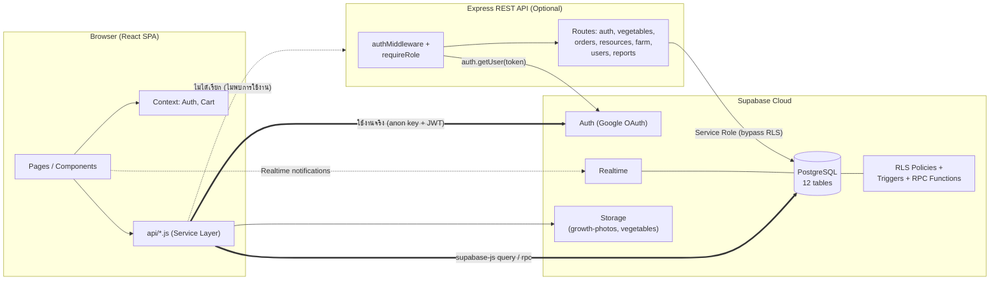
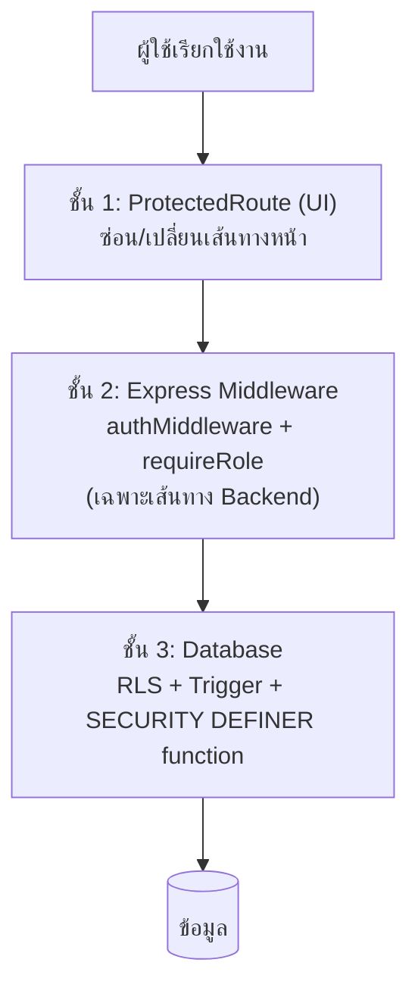
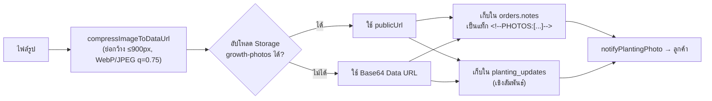
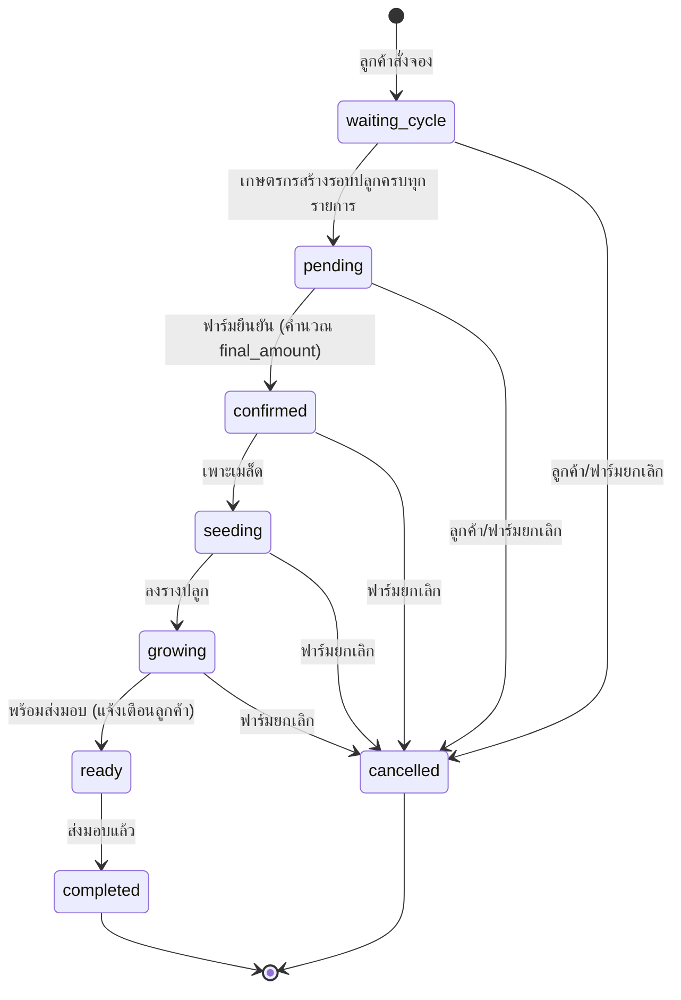
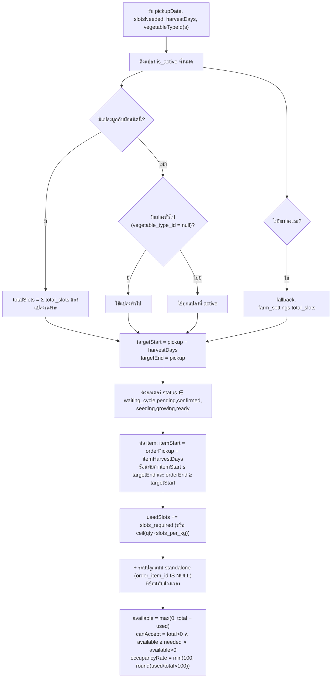
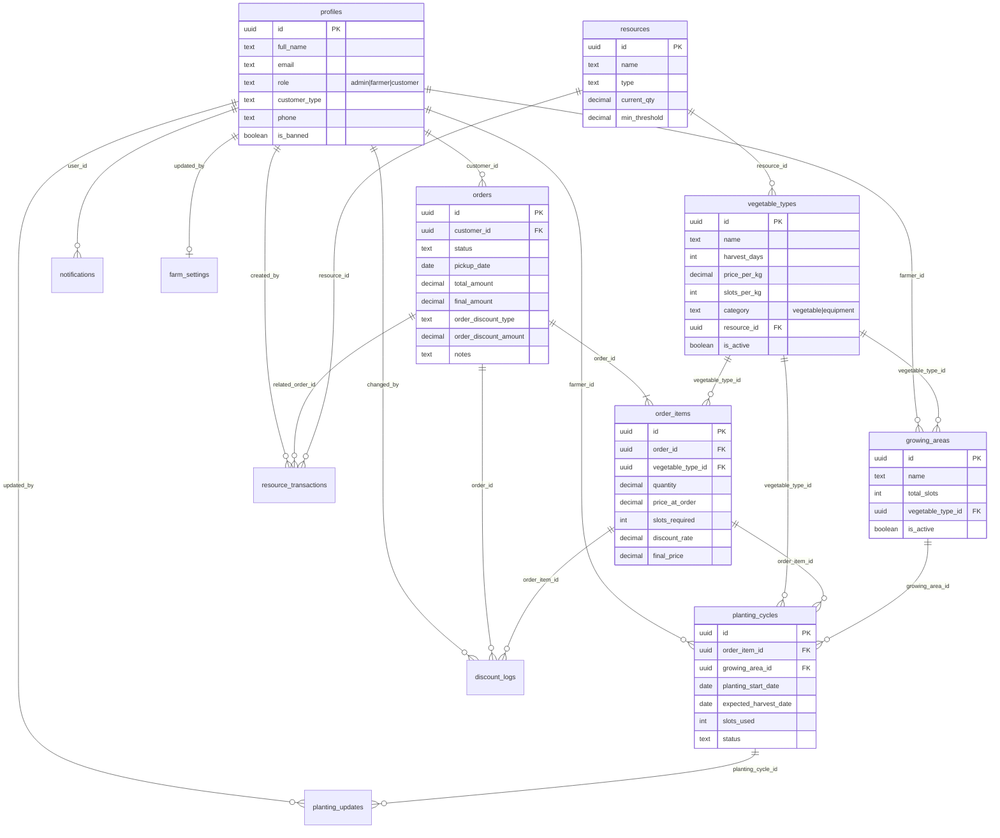
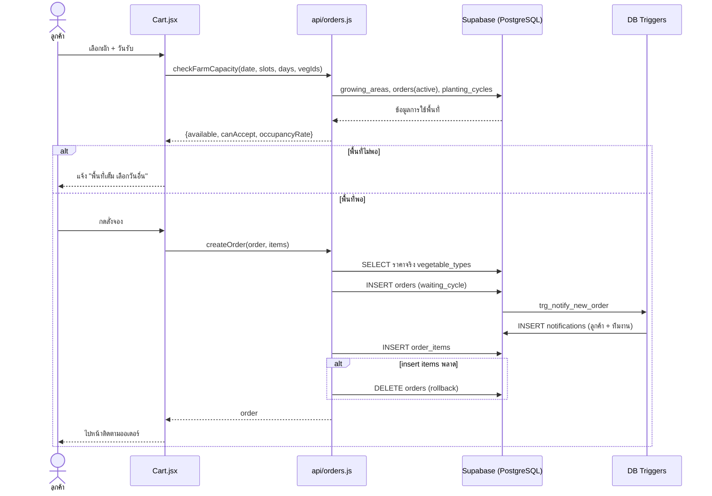
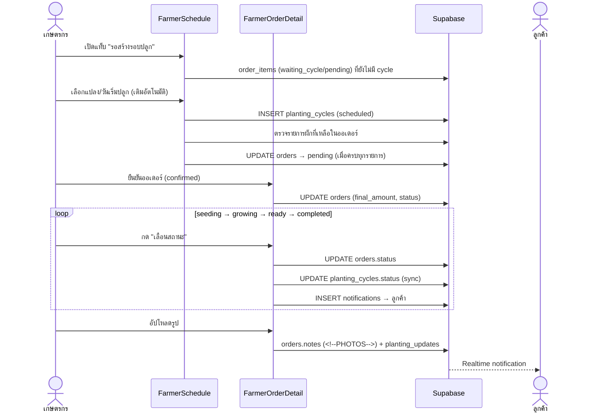
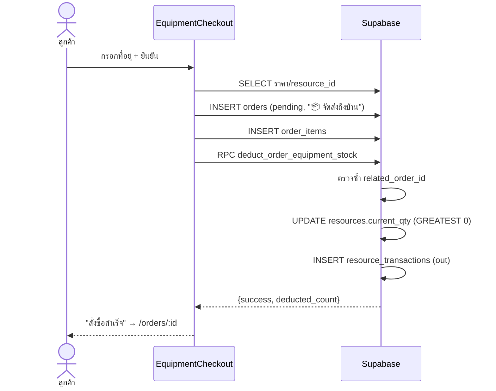

# เอกสารวิเคราะห์ระบบ HydroFarm Preorder System

> เอกสารนี้จัดทำจากการอ่านซอร์สโค้ดจริงของโปรเจกต์ (`backend/`, `frontend/`, ไฟล์ SQL ทั้งหมด)
> เพื่อใช้เป็นข้อมูลประกอบการเขียนเล่มปริญญานิพนธ์ ทุกตัวเลข ชื่อฟังก์ชัน และชื่อตารางอ้างอิงจากโค้ดในโปรเจกต์
> ส่วนที่เป็น "ข้อสังเกต/ข้อจำกัด" (หัวข้อ 14) เป็นผลการวิเคราะห์จากโค้ด ไม่ได้มาจากการทดสอบรันระบบจริง

---

## สารบัญ

1. [ภาพรวมและวัตถุประสงค์ของระบบ](#1-ภาพรวมและวัตถุประสงค์ของระบบ)
2. [เทคโนโลยีที่ใช้](#2-เทคโนโลยีที่ใช้)
3. [สถาปัตยกรรมระบบ](#3-สถาปัตยกรรมระบบ)
4. [โครงสร้างโปรเจกต์](#4-โครงสร้างโปรเจกต์)
5. [ผู้ใช้งานและสิทธิ์ (RBAC)](#5-ผู้ใช้งานและสิทธิ์-rbac)
6. [ฟังก์ชันการทำงานแยกตามโมดูล](#6-ฟังก์ชันการทำงานแยกตามโมดูล)
7. [วงจรสถานะคำสั่งซื้อ (Order Lifecycle)](#7-วงจรสถานะคำสั่งซื้อ-order-lifecycle)
8. [อัลกอริทึมและตรรกะทางธุรกิจที่สำคัญ](#8-อัลกอริทึมและตรรกะทางธุรกิจที่สำคัญ)
9. [การออกแบบฐานข้อมูล](#9-การออกแบบฐานข้อมูล)
10. [REST API ฝั่ง Backend](#10-rest-api-ฝั่ง-backend)
11. [ชั้นบริการฝั่ง Frontend และเส้นทางหน้าเว็บ](#11-ชั้นบริการฝั่ง-frontend-และเส้นทางหน้าเว็บ)
12. [ความปลอดภัยของระบบ](#12-ความปลอดภัยของระบบ)
13. [Sequence Diagram ของ Use Case หลัก](#13-sequence-diagram-ของ-use-case-หลัก)
14. [ข้อสังเกต ข้อจำกัด และแนวทางพัฒนาต่อ](#14-ข้อสังเกต-ข้อจำกัด-และแนวทางพัฒนาต่อ)
15. [สรุปตัวเลขเชิงสถิติของระบบ](#15-สรุปตัวเลขเชิงสถิติของระบบ)

---

## 1. ภาพรวมและวัตถุประสงค์ของระบบ

**HydroFarm Preorder System** คือเว็บแอปพลิเคชันสำหรับฟาร์มผักไฮโดรโปนิกส์ ให้ลูกค้า **สั่งจองผักล่วงหน้า (Pre-order)** และสั่งซื้ออุปกรณ์ปลูกผัก
ขณะเดียวกันเป็นระบบหลังบ้านให้เกษตรกรและผู้ดูแลระบบบริหารจัดการการผลิต โดยแก้ปัญหาหลักของฟาร์มแบบ "ปลูกตามออเดอร์" ดังนี้

| ปัญหา | วิธีที่ระบบแก้ |
|---|---|
| ฟาร์มมีพื้นที่ปลูกจำกัด รับออเดอร์เกินกำลังผลิตไม่ได้ | ตรวจสอบ **ความจุแปลงปลูก (Capacity)** แบบเรียลไทม์ ก่อนรับออเดอร์ทุกครั้ง |
| ต้องวางแผนวันเริ่มปลูกให้ตรงกับวันที่ลูกค้าต้องการรับ | คำนวณ **วันเริ่มปลูกย้อนหลัง (Backward Scheduling)** จากวันรับสินค้า |
| ลูกค้าอยากรู้ว่าผักของตนอยู่ขั้นตอนไหน | **Timeline สถานะ + รูปภาพการเจริญเติบโต + แจ้งเตือน** |
| ต้องคุมสต็อกเมล็ดพันธุ์ ปุ๋ย อุปกรณ์ | ระบบ **คลังทรัพยากร** พร้อมตัดสต็อกอัตโนมัติและแจ้งเตือนของใกล้หมด |
| ลูกค้าแต่ละกลุ่ม (ร้านอาหาร โรงแรม ขายส่ง) ต้องการราคาพิเศษ | ระบบ **ส่วนลดต่อรายการ + ส่วนลดทั้งออเดอร์ + Audit Log** |
| ผู้บริหารต้องการสรุปยอดและส่งออกข้อมูล | **Dashboard, รายงาน, ส่งออก Excel/CSV** |

**กลุ่มผู้ใช้:** ลูกค้า (customer), เกษตรกร (farmer), ผู้ดูแลระบบ (admin)

**สินค้าในระบบมี 2 ประเภท** (ตาราง `vegetable_types.category`)
- `vegetable` — ผักไฮโดรโปนิกส์ (สั่งจองล่วงหน้า ต้องมีรอบปลูก)
- `equipment` — อุปกรณ์/ชุดปลูก (สั่งซื้อและจัดส่งถึงบ้าน ไม่มีรอบปลูก)

---

## 2. เทคโนโลยีที่ใช้

### 2.1 Frontend (`frontend/package.json`)
| เทคโนโลยี | เวอร์ชัน | หน้าที่ |
|---|---|---|
| React | ^19.2.7 | UI Library |
| Vite | ^8.1.1 | Build tool / Dev server |
| React Router DOM | ^7.18.1 | Routing ฝั่ง Client (SPA) |
| Tailwind CSS | ^3.4.19 | Styling (ธีมสีเขียว `forest`, ฟอนต์ Sarabun) |
| @supabase/supabase-js | ^2.110.8 | เชื่อมต่อ Auth/Database/Realtime/Storage |
| Recharts | ^3.10.0 | กราฟ (Bar, Area, Pie) ใน Dashboard/รายงาน |
| date-fns | ^4.4.0 | คำนวณและจัดรูปแบบวันที่ (locale ไทย) |
| xlsx | ^0.18.5 | ส่งออกไฟล์ Excel |
| react-hot-toast | ^2.6.0 | แจ้งเตือนแบบ Toast |
| lucide-react | ^1.25.0 | ไอคอน |
| axios | ^1.18.1 | ติดตั้งไว้ แต่ **ไม่ได้ถูกเรียกใช้ในโค้ด** (ดูหัวข้อ 14) |
| oxlint | ^1.71.0 | Linter |

### 2.2 Backend (`backend/package.json`)
| เทคโนโลยี | เวอร์ชัน | หน้าที่ |
|---|---|---|
| Node.js (ES Modules) | — | Runtime (`"type": "module"`) |
| Express | ^4.19.2 | REST API Framework |
| @supabase/supabase-js | ^2.45.0 | เชื่อม Supabase ด้วย **Service Role Key** |
| cors | ^2.8.5 | จัดการ CORS |
| dotenv | ^16.4.5 | โหลดตัวแปรสภาพแวดล้อม |
| multer | ^1.4.5-lts.1 | ติดตั้งไว้ (ไม่พบการใช้งาน) |

### 2.3 Database & Platform
- **Supabase (PostgreSQL)** — ฐานข้อมูลหลัก, Authentication (Google OAuth), Row Level Security, Realtime, Storage
- **Vercel** — Deploy frontend (`frontend/vercel.json` rewrite ทุก path ไป `/index.html` เพื่อรองรับ SPA)
- **Root `package.json`** — ใช้ `concurrently` รัน frontend + backend พร้อมกันด้วย `npm run dev`

---

## 3. สถาปัตยกรรมระบบ

### 3.1 ภาพรวม



### 3.2 ข้อค้นพบสำคัญด้านสถาปัตยกรรม

จากการค้นโค้ดพบว่า **Frontend เรียก Supabase โดยตรงทั้งหมด** (ผ่าน `frontend/src/api/*.js` และ `supabase.from(...)` ในหน้าต่าง ๆ)
ไม่มีการเรียก Express backend (ไม่พบ `axios`, `fetch('/api/...')` หรือการอ่านค่า `VITE_API_URL` ในโค้ด `frontend/src`)

ดังนั้นระบบมี **2 ชั้นที่ทำหน้าที่คล้ายกัน** คือ

| ชั้น | บทบาทปัจจุบัน | การควบคุมสิทธิ์ |
|---|---|---|
| **Frontend → Supabase โดยตรง** | เส้นทางที่ใช้งานจริงของระบบ | RLS Policy + Trigger + RPC (SECURITY DEFINER) ในฐานข้อมูล |
| **Express Backend** | REST API ทางเลือก/พร้อมใช้ (มี 31 endpoint) | `authMiddleware` + `requireRole` ในโค้ด Node.js, ใช้ Service Role ข้าม RLS |

> **ข้อเสนอการนำเสนอในเล่ม:** อธิบายว่าระบบออกแบบแบบ *Backend-as-a-Service (BaaS)* โดยย้ายตรรกะความปลอดภัยไปอยู่ที่ฐานข้อมูล
> (RLS, Trigger, Stored Function) และมี Express API เป็นชั้นสำรองสำหรับขยายระบบ เช่น เชื่อมระบบภายนอก/Mobile App ในอนาคต

### 3.3 รูปแบบการออกแบบ (Design Patterns) ที่พบในโค้ด

| รูปแบบ | ตำแหน่ง | คำอธิบาย |
|---|---|---|
| **Context Provider** | `AuthContext.jsx`, `CartContext.jsx` | แชร์สถานะผู้ใช้/ตะกร้าทั้งแอป |
| **Route Guard (HOC)** | `ProtectedRoute.jsx` | ตรวจ login/ban/role ก่อนแสดงหน้า |
| **Service Layer** | `frontend/src/api/*.js` | แยกตรรกะข้อมูลออกจาก UI |
| **Middleware Chain** | `authMiddleware` → `requireRole(...)` | ตรวจ JWT แล้วตรวจ role (Backend) |
| **RPC-first with Fallback** | `applyOrderItemDiscount`, `deductEquipmentStock`, `addResourceTransaction`, `getLowStockResources`, `getTopVegetables`, `notifyStaffNewOrder` | เรียก Stored Function ก่อน ถ้าไม่พร้อมจึงทำใน Client |
| **Schema-compat Cache Flags** | `supportsCustomerType`, `supportsDiscountLogs` ใน `api/orders.js` | จำสถานะว่าฐานข้อมูล migrate แล้วหรือยัง ป้องกัน HTTP 400 ซ้ำ |
| **Optimistic Rollback** | `createOrder`, `EquipmentCheckout` | ถ้าสร้าง `order_items` ไม่สำเร็จ ลบ `orders` ทิ้ง |
| **Soft Delete** | `deleteVegetable` | ตั้ง `is_active = false` แทนการลบจริง |
| **Observer (Realtime)** | `NotificationDropdown` | Subscribe `postgres_changes` + Polling สำรองทุก 30 วินาที |

---

## 4. โครงสร้างโปรเจกต์

```
hydroponic-fram-main/
├── package.json                    # สคริปต์รวม (concurrently รัน FE+BE)
├── backend/
│   ├── src/
│   │   ├── index.js                # Express app, CORS, mount routes, error handler
│   │   ├── services/supabaseClient.js    # Supabase client (Service Role)
│   │   └── api/
│   │       ├── middleware/
│   │       │   ├── authMiddleware.js     # ตรวจ JWT + โหลด role + เช็ค is_banned
│   │       │   └── roleMiddleware.js     # requireRole(...roles)
│   │       └── routes/
│   │           ├── auth.js  vegetables.js  orders.js  resources.js
│   │           └── farmSettings.js  users.js  reports.js
│   ├── supabase_schema.sql         # Schema หลัก + RLS + Functions + Triggers + Sample data
│   ├── migration_fix_discount_and_profiles.sql
│   ├── migration_add_order_level_discount.sql
│   ├── migration_security_fixes_1_to_4.sql
│   ├── migration_security_fixes_5_to_7.sql
│   └── fix_vegetable_types_rls.sql
└── frontend/
    ├── vercel.json  vite.config.js  tailwind.config.js
    └── src/
        ├── main.jsx  App.jsx       # ตั้ง Provider + Routes ทั้งหมด
        ├── context/                # AuthContext, CartContext
        ├── api/                    # auth, orders, vegetables, resources,
        │                           # reports, notifications, supabaseClient
        ├── utils/                  # dateUtils, csvExport, customerTypeUtils,
        │                           # orderPhotoUtils, imageUtils
        ├── components/
        │   ├── ProtectedRoute.jsx
        │   ├── layout/             # Navbar, Sidebar, Footer, NotificationDropdown
        │   ├── orders/             # StatusTimeline, OrderStatusBadge
        │   └── products/           # VegetableCard
        └── pages/
            ├── Home, Login, AuthCallback
            ├── customer/           # 7 หน้า
            ├── farmer/             # 6 หน้า
            └── admin/              # 8 หน้า
```

---

## 5. ผู้ใช้งานและสิทธิ์ (RBAC)

### 5.1 บทบาท

| Role | ค่าใน DB | เข้าสู่ระบบแล้วไปหน้า | ลักษณะ |
|---|---|---|---|
| ลูกค้า | `customer` (ค่าเริ่มต้น) | `/` | สมัครอัตโนมัติเมื่อ Login Google ครั้งแรก |
| เกษตรกร | `farmer` | `/farmer` | Admin เป็นผู้กำหนดให้ |
| ผู้ดูแลระบบ | `admin` | `/admin` | สิทธิ์สูงสุด |

นอกจาก role ยังมี **ประเภทลูกค้า** (`profiles.customer_type`): `ทั่วไป`, `ร้านอาหาร`, `โรงแรม`, `ขายส่ง`, `องค์กร`
ใช้จัดกลุ่มและแสดงป้ายสี/ไอคอนต่างกัน (`utils/customerTypeUtils.js`) เพื่อให้ทีมงานเห็นประเภทลูกค้าชัดเจนเวลากำหนดส่วนลด

### 5.2 ตารางสิทธิ์การเข้าถึงหน้า (จาก `App.jsx`)

| เส้นทาง | Public | customer | farmer | admin |
|---|:-:|:-:|:-:|:-:|
| `/`, `/login`, `/products`, `/products/:id` | ✅ | ✅ | ✅ | ✅ |
| `/cart`, `/orders`, `/order/new/:id`, `/equipment/checkout` | ❌ | ✅ | ❌ | ✅ |
| `/orders/:id` (ติดตามออเดอร์) | ❌ | ✅ | ✅ | ✅ |
| `/farmer`, `/farmer/schedule`, `/farmer/orders`, `/farmer/orders/:id`, `/farmer/order-history`, `/farmer/resources`, `/farmer/vegetables` | ❌ | ❌ | ✅ | ✅ |
| `/admin` (แดชบอร์ด), `/admin/orders`, `/admin/order-history`, `/admin/users`, `/admin/farm-settings`, `/admin/growing-areas`, `/admin/resources`, `/admin/reports` | ❌ | ❌ | ❌ | ✅ |
| `/admin/vegetables`, `/admin/orders/:id` | ❌ | ❌ | ✅ | ✅ |

### 5.3 การป้องกัน 3 ชั้น (Defense in Depth)



> หมายเหตุ: ชั้น 1 เป็นเพียง UX ผู้ใช้ที่มีความรู้สามารถข้ามได้ ความปลอดภัยจริงต้องอาศัยชั้น 3 (RLS) เป็นหลักเพราะ Frontend คุยกับฐานข้อมูลตรง

---

## 6. ฟังก์ชันการทำงานแยกตามโมดูล

### 6.1 โมดูลยืนยันตัวตนและโปรไฟล์ (Authentication)

**ไฟล์:** `api/auth.js`, `context/AuthContext.jsx`, `pages/Login.jsx`, `pages/AuthCallback.jsx`, `components/ProtectedRoute.jsx`

| ฟังก์ชัน | ไฟล์ | การทำงาน |
|---|---|---|
| `signInWithGoogle()` | `api/auth.js` | เรียก `supabase.auth.signInWithOAuth({provider:'google'})` โดย redirect กลับมาที่ `/auth/callback` |
| `signOut()` | `api/auth.js` | ลบ `equipment_cart` ออกจาก localStorage แล้ว sign out |
| `getSession()` | `api/auth.js` | ดึง session ปัจจุบัน |
| `getProfile(userId)` | `api/auth.js` | ดึงแถว `profiles` (มี role) |
| `AuthProvider` | `AuthContext.jsx` | โหลด session เริ่มต้น + ฟัง `onAuthStateChange` เก็บ `user`, `profile`, `loading` และสร้างตัวช่วย `role`, `isAdmin`, `isFarmer`, `isCustomer`, `isBanned`, `isLoggedIn` |
| `loadProfile()` | `AuthContext.jsx` | โหลดโปรไฟล์; ถ้ายังไม่มี `full_name` (หรือเป็น `'ลูกค้าทั่วไป'`) จะเติมจาก Google metadata/อีเมลอัตโนมัติ; ถ้าโหลดพลาดจะ **retry 1 ครั้งหลังหน่วง 500ms**; หากยังไม่ได้ จะตั้ง `profile = null` (ไม่ fallback เป็น customer เพื่อไม่ให้ farmer/admin ถูกส่งผิดหน้า) |
| ล้างตะกร้าตอน Logout | `AuthContext.jsx` | ลบ key `equipment_cart`, `hydro_cart`, `hydro_cart_guest` |
| `AuthCallback` | `AuthCallback.jsx` | แลก `code` → session (PKCE) แล้วอ่าน role redirect: admin→`/admin`, farmer→`/farmer`, อื่น ๆ→`/`; มี timeout สำรอง 15 วินาทีส่งไป `/login` |
| `Login` | `Login.jsx` | ปุ่ม Google Login; ถ้า login แล้วและ role โหลดแล้ว จะ redirect ตาม role |
| `ProtectedRoute` | `ProtectedRoute.jsx` | ลำดับตรวจ: loading → ไม่ login (`/login`) → ถูกแบน (`/banned`) → role ยังไม่โหลด (spinner; เกิน **6 วินาที** แสดงหน้าให้ "รีเฟรช/ออกจากระบบ") → role ไม่อยู่ใน `allowedRoles` (`/unauthorized`) |

**การสร้างโปรไฟล์อัตโนมัติ (ฝั่ง DB):** Trigger `on_auth_user_created` → ฟังก์ชัน `handle_new_user()` สร้างแถวใน `profiles` ทุกครั้งที่มี user ใหม่ใน `auth.users`
โดยใช้ชื่อจาก Google metadata หรือส่วนหน้าของอีเมล และ `ON CONFLICT DO UPDATE` เพื่อรองรับกรณีซ้ำ

**ตัวป้องกันการยกระดับสิทธิ์:** Trigger `trg_protect_profile_fields` (`protect_profile_fields()`) บล็อกไม่ให้ผู้ใช้ที่ไม่ใช่ admin แก้ `role`, `is_banned`, `customer_type`
(ยกเว้น `service_role` หรือไม่มี `auth.uid()`)

---

### 6.2 โมดูลแคตตาล็อกสินค้า (ผักและอุปกรณ์)

**ไฟล์:** `api/vegetables.js`, `pages/customer/ProductList.jsx`, `ProductDetail.jsx`, `components/products/VegetableCard.jsx`, `pages/Home.jsx`, `pages/admin/AdminVegetables.jsx`

#### ฝั่งลูกค้า
| ฟังก์ชัน/หน้า | การทำงาน |
|---|---|
| `getVegetables(category)` | ดึงสินค้า `is_active = true` เรียงตามชื่อ กรองตาม category ได้ |
| `getVegetableById(id)` | ดึงสินค้าชิ้นเดียว |
| `ProductList` | แสดงการ์ดสินค้า, แท็บหมวด (ทั้งหมด/ผัก/อุปกรณ์) ผูกกับ query string `?category=`, ช่องค้นหา (ชื่อ/คำอธิบาย) |
| `VegetableCard.handleQuickAdd` | เพิ่มลงตะกร้าด่วน (1 กก. สำหรับผัก / 1 ชิ้น สำหรับอุปกรณ์) |
| `ProductDetail` | รายละเอียดสินค้า ปรับจำนวน (ผัก ทีละ **0.5 กก.**, อุปกรณ์ทีละ 1), `handleAddToCart`, `handleBuyNow` (เพิ่มแล้วไป `/cart`) |
| `Home.fetchTopVegetables` | ดึง "ผักยอดนิยม" จาก `order_items` (ไม่รวมออเดอร์ยกเลิก) รวมปริมาณตามชนิด เรียงมากไปน้อย 6 อันดับแรก; ถ้ายังไม่มีออเดอร์ fallback แสดงผัก active 6 รายการ |

#### ฝั่งจัดการ (Admin/Farmer)
| ฟังก์ชัน | การทำงาน |
|---|---|
| `createVegetable()` / `updateVegetable()` | ล้างฟิลด์ที่ไม่ควรส่ง (`id`, `created_at`, `vegetable_types`) แปลง `price_per_kg` เป็นตัวเลข และ `resource_id` ว่าง→`null` |
| `deleteVegetable()` | Soft delete (`is_active=false`) |
| `AdminVegetables.handleSave` | เมื่อ category = `vegetable` เก็บ `harvest_days`(ค่าเริ่มต้น 30), `germination_days`(7), `transfer_days`(14), `slots_per_kg`(4); เมื่อเป็น `equipment` ตั้งค่าเหล่านี้เป็น null/0 และผูก `resource_id` (สต็อกที่จะถูกตัดอัตโนมัติ) |
| `AdminVegetables.handleImageUpload` | อัปโหลดรูปไป Storage bucket `vegetables` → ถ้าไม่สำเร็จลอง `growth-photos/vegetables/` → ถ้ายังไม่ได้ แปลงเป็น **Base64 Data URL** |
| ตัวกรอง/ค้นหา | กรองตามหมวด (ทั้งหมด/ผัก/อุปกรณ์) และคำค้น พร้อมตัวนับจำนวน |

พารามิเตอร์สำคัญของสินค้าผัก: `harvest_days` (วันปลูกถึงเก็บเกี่ยว), `slots_per_kg` (ช่องปลูกที่ใช้ต่อ 1 กก.), `price_per_kg`

---

### 6.3 โมดูลตะกร้าสินค้า (Cart)

**ไฟล์:** `context/CartContext.jsx`, `pages/customer/Cart.jsx`

| ฟังก์ชัน | การทำงาน |
|---|---|
| `getCartKey(uid)` | คืน key localStorage แยกตามผู้ใช้: `hydro_cart_<uid>` หรือ `hydro_cart_guest` → **ตะกร้าแยกรายบัญชี** |
| `normalizeCartItem` | ทำให้ `price` และ `price_per_kg` เป็นตัวเลขเดียวกันเสมอ |
| `addToCart(product, qty)` | ถ้ามีในตะกร้า → บวกจำนวน (ผักปัดทศนิยม 1 ตำแหน่ง, อุปกรณ์ปัดเป็นจำนวนเต็ม); ถ้าไม่มี → เพิ่มรายการใหม่ |
| `updateQty(id, newQty)` | ขั้นต่ำผัก **0.5 กก.** / อุปกรณ์ **1 ชิ้น**; ต่ำกว่าขั้นต่ำ = ลบออกจากตะกร้า |
| `removeFromCart`, `clearCart`, `clearCartCategory(cat)` | ลบรายการ/ล้างทั้งหมด/ล้างเฉพาะหมวด |
| ค่าที่คำนวณ | `vegItems`, `equipItems`, `totalItems`, `totalItemCount`, `vegTotalPrice`, `equipTotalPrice`, `totalPrice`, `vegTotalWeight` |

**หน้า `Cart.jsx`** แยกตะกร้าเป็น 2 ส่วนอิสระ (ผัก = พรีออเดอร์, อุปกรณ์ = ส่งถึงบ้าน) มีลอจิกดังนี้
- `maxHarvestDays` = ค่า `harvest_days` สูงสุดของผักในตะกร้า → `minPickupDate = getMinPickupDate(maxHarvestDays)` (วันนี้ + harvest_days + 1)
- `totalSlotsNeeded` = Σ `ceil(qty × slots_per_kg)` (default 4)
- เมื่อเปลี่ยนวันรับ/รายการ จะเรียก `checkFarmCapacity` อัตโนมัติ (`runCapacityCheck`) และแสดงแถบสัดส่วนการใช้พื้นที่
- `handleOrderVegetables`: ตรวจ login → ตรวจรายการ → ตรวจ `capacity.canAccept` → อัปเดตชื่อ/เบอร์ใน `profiles` → ประกอบ `notes` (ผู้สั่งซื้อ/เบอร์/อีเมล) → `createOrder()` ด้วยสถานะ **`waiting_cycle`** → ล้างเฉพาะผักออกจากตะกร้า → ไปหน้าติดตามออเดอร์

---

### 6.4 โมดูลสั่งจองผัก (Pre-order) และตรวจสอบความจุ

**ไฟล์:** `pages/customer/NewOrder.jsx`, `api/orders.js` (`createOrder`, `checkFarmCapacity`)

| ฟังก์ชัน | การทำงาน |
|---|---|
| `NewOrder` | สั่งจองผักชนิดเดียวแบบรวดเร็ว: เลือกจำนวน (ปุ่ม ±0.5, ทางลัด 0.5/1/1.5/2/3 กก.), เลือกวันรับ (ขั้นต่ำ = วันนี้ + harvest_days + 1), แสดงตารางปลูกย้อนหลังด้วย `calculatePlantingSchedule` |
| `createOrder(orderData, items)` (Frontend) | **ตรวจราคาจริงจากฐานข้อมูล** (ดึง `price_per_kg`, `unit`, `slots_per_kg` ของแต่ละสินค้าแทนค่าจาก localStorage) → คำนวณ `total_amount` ใหม่ → insert `orders` → insert `order_items` → ถ้า items พลาด **rollback ลบ order** → ส่งแจ้งเตือนลูกค้า+ทีมงาน |
| `checkFarmCapacity(pickupDate, slotsNeeded, harvestDays, vegetableTypeId)` | คำนวณความจุคงเหลือ (รายละเอียดหัวข้อ 8.2) รองรับ `vegetableTypeId` เป็น array |
| `getCurrentFarmOccupancy()` | เรียก `checkFarmCapacity(วันนี้, 0, 1)` สำหรับ Dashboard |

---

### 6.5 โมดูลสั่งซื้ออุปกรณ์ (Equipment Checkout)

**ไฟล์:** `pages/customer/EquipmentCheckout.jsx`

กระบวนการ 3 ขั้น: (1) ตรวจรายการ → (2) กรอกที่อยู่จัดส่ง → (3) สำเร็จ แล้ว redirect ไป `/orders/:id` หลัง 2.5 วินาที

ขั้นตอนใน `handlePlaceOrder`
1. กำหนดวันจัดส่งคาดการณ์ = **วันนี้ + 3 วัน**
2. รวมที่อยู่จากฟิลด์ (ที่อยู่/ตำบล/อำเภอ/จังหวัด/รหัสไปรษณีย์)
3. **ตรวจราคาจริง** จาก `vegetable_types` และคำนวณยอดรวมใหม่
4. insert `orders` สถานะ **`pending`** (อุปกรณ์ข้ามสถานะ `waiting_cycle`) โดยใส่ `notes` ขึ้นต้นด้วย `📦 จัดส่งถึงบ้าน` + ผู้รับ/โทร/ที่อยู่ — ข้อความนี้ใช้เป็น **ตัวบ่งชี้ว่าเป็นออเดอร์อุปกรณ์** ด้วย
5. insert `order_items` (`slots_required = 0`) — ถ้าพลาด rollback
6. ส่งแจ้งเตือนลูกค้า/ทีมงาน
7. **ตัดสต็อกอัตโนมัติ**: เรียก RPC `deduct_order_equipment_stock` ก่อน; ถ้าไม่สำเร็จ fallback ตัดทีละรายการผ่าน `adjust_resource_qty` หรืออัปเดต `resources` ตรง แล้วบันทึก `resource_transactions` (มี `related_order_id`)
8. ล้างตะกร้า

---

### 6.6 โมดูลติดตามและยกเลิกคำสั่งซื้อ (ลูกค้า)

**ไฟล์:** `pages/customer/OrderHistory.jsx`, `OrderTracking.jsx`, `components/orders/StatusTimeline.jsx`, `OrderStatusBadge.jsx`

| ฟังก์ชัน | การทำงาน |
|---|---|
| `getMyOrders(customerId)` | ดึงออเดอร์ของตน พร้อม items + ข้อมูลสินค้า |
| `getOrderById(orderId)` | ดึงรายละเอียดเต็ม: โปรไฟล์ลูกค้า, items, `planting_cycles`, `growing_areas`, `planting_updates` พร้อม **fallback แบบขั้นบันได** หาก DB ยังไม่มีคอลัมน์ `customer_type`/`email` |
| `OrderHistory.handleReorder` | **สั่งซ้ำ**: นำรายการเดิมใส่ตะกร้า (ใช้ราคาที่เคยสั่ง หากเป็น 0 ใช้ราคาปัจจุบัน) แล้วไป `/cart` |
| `OrderTracking` | แสดง Timeline, รายการสินค้า, ยอด (ก่อน/หลังส่วนลด), แกลเลอรีรูปการเจริญเติบโต, หมายเหตุ |
| `canCancel` | ลูกค้ายกเลิกได้เฉพาะสถานะ `waiting_cycle` หรือ `pending` |
| `handleConfirmCancel` | เลือกเหตุผล (5 ตัวเลือก) → ต่อท้ายใน `notes` ด้วยข้อความ `[ลูกค้ายกเลิกคำสั่งซื้อ: ... ]` → `updateOrderStatus(..., 'cancelled')` → `notifyStaffCancelOrder` |
| `StatusTimeline` | วาดเส้นเวลาตาม flow (ผัก 7 ขั้น / อุปกรณ์ 4 ขั้น); ถ้ายกเลิกจะแสดงการ์ดสีแดง |
| `OrderStatusBadge` | ป้ายสถานะ (ข้อความต่างกันระหว่างผักกับอุปกรณ์) |

---

### 6.7 โมดูลจัดการออเดอร์ (เกษตรกร/แอดมิน)

**ไฟล์:** `pages/farmer/FarmerOrders.jsx`, `FarmerOrderHistory.jsx`, `FarmerOrderDetail.jsx`, `pages/admin/AdminOrders.jsx`

| หน้า | การทำงาน |
|---|---|
| `FarmerOrders` / `AdminOrders` | รายการออเดอร์ที่ **ยังไม่จบ** (กรอง completed/cancelled ออก), กรองตามสถานะ/ประเภทสินค้า (ผัก/อุปกรณ์), ค้นหาชื่อลูกค้า/เลขออเดอร์/เบอร์/ชื่อสินค้า, เปลี่ยนสถานะ (`handleStatus`), `AdminOrders` ส่งออก Excel ได้ |
| `FarmerOrderHistory` | ประวัติ `completed` + `cancelled` (โหลดสองครั้งแล้วรวม เรียงล่าสุดก่อน) พร้อมตัวนับ |
| `FarmerOrderDetail` | หน้าจัดการออเดอร์ครบวงจร (ดูตารางด้านล่าง) |

**ฟังก์ชันใน `FarmerOrderDetail.jsx`**

| ฟังก์ชัน | การทำงาน |
|---|---|
| `loadOrder` | โหลดออเดอร์ + ตั้งค่าเริ่มต้นช่องส่วนลด + โหลด `discount_logs` |
| `handleStatusUpdate` | เลื่อนสถานะไปขั้นถัดไปด้วย `getNextStatus` แล้ว **ซิงก์สถานะ `planting_cycles`** (seeding→seeding, growing→growing, ready→ready, completed→done) |
| `handleFarmerCancelOrder` | ยกเลิกโดยฟาร์ม: อัปเดตสถานะ, ยกเลิก `planting_cycles` ที่เกี่ยวข้อง, ส่งแจ้งเตือนลูกค้าพร้อมเหตุผล |
| `handleSaveDiscount(itemId)` | บันทึกส่วนลดต่อรายการ (0–100%) |
| `handleSaveOrderDiscount` | บันทึกส่วนลดทั้งออเดอร์ (บาท/เปอร์เซ็นต์) หรือล้างส่วนลด |
| `handlePhotoUpload` | อัปโหลดรูปความคืบหน้า (รายละเอียดหัวข้อ 6.9) |
| `isDiscountEditable` | UI อนุญาตแก้ส่วนลดเฉพาะสถานะ `waiting_cycle`, `pending`, `scheduling` — หลังยืนยันจะ "ล็อก" |

---

### 6.8 โมดูลตารางรอบปลูก (Planting Schedule)

**ไฟล์:** `pages/farmer/FarmerSchedule.jsx`

เป็นหัวใจของการ "ปลูกตามออเดอร์" มี 2 แท็บ: **รอบปลูกทั้งหมด** และ **รอสร้างรอบปลูก**

| ฟังก์ชัน | การทำงาน |
|---|---|
| `calcPlantingStart(pickup, harvestDays)` | วันเริ่มปลูก = `pickup_date − harvest_days` |
| `calcExpectedHarvest(start, harvestDays)` | วันเก็บเกี่ยวคาดการณ์ = `start + harvest_days` |
| `loadAll` | ดึง `planting_cycles`, `order_items` ของออเดอร์ `waiting_cycle`/`pending` ที่ **ยังไม่มีรอบปลูก (เฉพาะผัก)**, และ `growing_areas` ที่ active (ใช้ `Promise.allSettled` ให้ส่วนที่ล้มเหลวไม่ทำให้ทั้งหน้าพัง) |
| `openCreateModal` | เปิดฟอร์มพร้อมเติมวันเริ่มปลูกอัตโนมัติจากวันรับ |
| `handleCreate` | insert `planting_cycles` (สถานะ `scheduled`, `slots_used = slots_required`) → ตรวจว่า **ผักทุกชนิดในออเดอร์มีรอบปลูกครบหรือยัง** → ถ้าครบ เรียก `updateOrderStatus(order.id,'pending')` ย้ายออเดอร์จาก `waiting_cycle` → `pending` |
| `activeCycles` (useMemo) | ซ่อนรอบปลูกที่ไม่มีออเดอร์เชื่อมอยู่ (orphaned) หรือจบ/ยกเลิก; แสดงสถานะรอบปลูกโดย **อนุมานจากสถานะออเดอร์** (`ORDER_TO_CYCLE_STATUS`) เพื่อให้ซิงก์กัน |

---

### 6.9 โมดูลรูปภาพความคืบหน้าการปลูก

**ไฟล์:** `FarmerOrderDetail.handlePhotoUpload`, `utils/imageUtils.js`, `utils/orderPhotoUtils.js`, `api/orders.addPlantingUpdate`

กลยุทธ์ **Dual-storage** เพื่อรับประกันว่าลูกค้าเห็นรูปเสมอแม้ RLS/Storage มีปัญหา



| ฟังก์ชัน | การทำงาน |
|---|---|
| `compressImageToDataUrl(file, maxWidth, quality)` | ย่อภาพด้วย Canvas เป็น WebP (fallback JPEG) |
| `appendPhotoToOrderNotes(notes, photo)` | เพิ่มรูปในแท็ก `<!--PHOTOS:[...]-->` (กันรูปซ้ำด้วย `photo_url`) |
| `extractPhotosFromOrder(order)` | รวมรูปจาก `planting_updates` และจาก `notes` ตัดซ้ำด้วย key 100 ตัวอักษรแรกของ URL เรียงใหม่→เก่า |
| `cleanOrderNotes(notes)` | ตัดแท็กรูปออกก่อนแสดง |
| `addPlantingUpdate(cycleId, {...})` | insert ลง `planting_updates` |
| ถ้ายังไม่มีรอบปลูก | `handlePhotoUpload` จะสร้าง `planting_cycles` อัตโนมัติ (`notes: 'สร้างอัตโนมัติจากการอัปโหลดรูปภาพ'`) เพื่อเก็บรูปเชิงสัมพันธ์ได้ |

---

### 6.10 โมดูลส่วนลด (Discount System)

**ไฟล์:** `api/orders.js` (`applyOrderItemDiscount`, `applyOrderDiscount`, `getOrderDiscountLogs`, `getAllDiscountLogs`), `FarmerOrderDetail.jsx`, `AdminReports.jsx`, ฟังก์ชัน SQL `apply_item_discount`, `apply_order_discount`

ระบบส่วนลด 2 ระดับ ใช้ร่วมกันได้

| ระดับ | ฟังก์ชัน | พารามิเตอร์ | ผลลัพธ์ที่บันทึก |
|---|---|---|---|
| **ต่อรายการ** | `applyOrderItemDiscount(orderId, itemId, rate, note, changedBy)` | `rate` 0–100 (%) | `order_items.discount_rate`, `discount_amount`, `final_price` |
| **ทั้งออเดอร์** | `applyOrderDiscount(orderId, {discountType, discountValue, note, changedBy})` | `percent` (≤100) หรือ `amount` (บาท) หรือ null (ล้าง) | `orders.order_discount_type/value/amount/note`, `final_amount` |

**ลอจิก RPC-first:** เรียก Stored Procedure ก่อน (Atomic + `SECURITY DEFINER` + ตรวจสิทธิ์ farmer/admin ภายใน) หากล้มเหลวจึงคำนวณและเขียนจาก Client
ทุกครั้งที่ปรับจะบันทึก **`discount_logs`** (ใครปรับ, อัตราเดิม→ใหม่, จำนวนเงิน, หมายเหตุ, เวลา) → ใช้เป็น **Audit Trail**

ดูสูตรคำนวณในหัวข้อ 8.4

**Discount Audit ในรายงาน:** `getAllDiscountLogs(limit)` join กับ `profiles` (ผู้ปรับ), `orders` (ลูกค้า), `order_items` (สินค้า) แล้วแสดง/ค้นหา/ส่งออกใน `AdminReports`

---

### 6.11 โมดูลคลังทรัพยากร (Resource / Inventory)

**ไฟล์:** `api/resources.js`, `pages/farmer/FarmerResources.jsx`, `pages/admin/AdminResources.jsx`

ประเภททรัพยากร: `seed` (เมล็ดพันธุ์), `fertilizer` (ปุ๋ย), `equipment` (อุปกรณ์), `other`

| ฟังก์ชัน | การทำงาน |
|---|---|
| `getResources()` | ดึงทั้งหมดเรียงตามชื่อ |
| `getLowStockResources()` | RPC `get_low_stock_resources` ก่อน; fallback กรองใน JS: `current_qty ≤ min_threshold` |
| `createResource` / `updateResource` | เพิ่ม/แก้ไข |
| `addResourceTransaction(resourceId, {transaction_type, quantity, notes, created_by})` | บันทึกประวัติลง `resource_transactions` แล้วปรับสต็อก: `adjust` = ตั้งค่าเป็นจำนวนใหม่ (ไม่ติดลบ); `in` = บวก; `out` = ลบ (ผ่าน RPC `adjust_resource_qty` แบบ Atomic, fallback อ่าน-คำนวณ-เขียน) |
| `deleteResource(id)` | ปลดการผูก `vegetable_types.resource_id` → ลบประวัติ transactions → ลบทรัพยากร (admin เท่านั้นผ่านหน้า AdminResources) |
| `deductEquipmentStock(orderId)` | ตัดสต็อกอุปกรณ์ในออเดอร์ (ตรวจซ้ำก่อนว่าเคยตัดแล้วหรือยังจาก `related_order_id`) |

**การตัดสต็อกอุปกรณ์อัตโนมัติ** เรียกเมื่อ (1) ลูกค้าสั่งอุปกรณ์สำเร็จ และ (2) เมื่อสถานะเปลี่ยนเป็น `confirmed`, `ready`, `completed`
ป้องกันตัดซ้ำด้วย: ตรวจ `resource_transactions.related_order_id` ทั้งฝั่ง Client และใน SQL function `deduct_order_equipment_stock` (Idempotent)

**การแจ้งเตือนของใกล้หมด:** Dashboard เปรียบเทียบ `current_qty ≤ min_threshold` และแสดงแบนเนอร์เตือนพร้อมลิงก์เติมสต็อก

---

### 6.12 โมดูลพื้นที่ปลูกและตั้งค่าฟาร์ม

**ไฟล์:** `pages/admin/AdminGrowingAreas.jsx`, `AdminFarmSettings.jsx`, `api/reports.js` (`getFarmSettings`, `updateFarmSettings`)

| ฟังก์ชัน | การทำงาน |
|---|---|
| `AdminGrowingAreas.load` | โหลดแปลง, ผักที่ผูกได้, และรอบปลูกที่ active |
| `handleSave` | เพิ่ม/แก้ไขแปลง: `name`, `zone_code`, `total_slots`, `vegetable_type_id` (ผูกแปลงกับผักชนิดเฉพาะได้), `is_active` |
| `handleDelete` | ลบแปลง (ถามยืนยัน) |
| การ์ดสรุป | จำนวนแปลง, ช่องปลูกรวม, ช่องที่ใช้อยู่ (Σ `slots_used` ของรอบปลูก `scheduled/seeding/growing` ต่อแปลง หรือ `current_slots_used`), อัตราการใช้งานรวม (แจ้งเตือน "เริ่มหนาแน่น" เมื่อ ≥ 80%) |
| `AdminFarmSettings` | ตั้งชื่อฟาร์ม และ `total_slots` (ค่าสำรองเมื่อยังไม่มีแปลงปลูกเลย) |

---

### 6.13 โมดูลจัดการผู้ใช้ (Admin)

**ไฟล์:** `pages/admin/AdminUsers.jsx`

| ฟังก์ชัน | การทำงาน |
|---|---|
| `loadUsers` | ดึง `profiles` ทั้งหมด |
| `updateRole(userId, role)` | เปลี่ยน role (customer/farmer/admin) — **ป้องกัน Admin ลดสิทธิ์ตัวเอง** |
| `updateCustomerType(userId, type)` | เปลี่ยนประเภทลูกค้า |
| `toggleBan(userId, isBanned)` | แบน/ปลดแบน — **ป้องกันแบนตัวเอง** |
| ตัวกรอง | ค้นหา (ชื่อ/อีเมล/เบอร์), role, ประเภทลูกค้า, สถานะบัญชี (active/banned), ปุ่มรีเซ็ต |
| ส่งออก | รายชื่อลูกค้าเป็น Excel/CSV |

ผู้ใช้ที่ถูกแบน (`is_banned = true`) จะถูก `ProtectedRoute` ส่งไป `/banned` และ Backend `authMiddleware` ตอบ 403

---

### 6.14 โมดูลแจ้งเตือน (Notifications)

**ไฟล์:** `api/notifications.js`, `components/layout/NotificationDropdown.jsx`, Trigger ใน SQL

| ฟังก์ชัน | ผู้รับ | ประเภท (`type`) |
|---|---|---|
| `notifyCustomerNewOrder` | ลูกค้า (เมื่อสั่งสำเร็จ) | `new_order` |
| `notifyStaffNewOrder` | เกษตรกร+แอดมินทุกคน | `new_order` |
| `notifyStaffCancelOrder` | เกษตรกร+แอดมิน (เมื่อลูกค้ายกเลิก) | `order_status` |
| `notifyOrderStatus` | ลูกค้า (เมื่อสถานะเปลี่ยน) ไอคอนต่างกัน: 🌱 seeding, 🌿 growing, 🎉 ready, ✅ completed, ❌ cancelled | `order_status` |
| `notifyPlantingPhoto` | ลูกค้า (เมื่อมีรูปใหม่) | `planting_photo` |
| `createNotification` | พื้นฐานสำหรับทุกกรณี | `general` |
| `getMyNotifications`, `getUnreadCount`, `markAsRead`, `markAllAsRead` | จัดการรายการแจ้งเตือน | — |

**การส่งถึงทีมงาน:** ใช้ RPC `notify_staff` (SECURITY DEFINER ข้ามข้อจำกัด RLS ของ `profiles`) → fallback ดึง `profiles` role farmer/admin แล้ว insert ทีละแถว

**ฝั่ง Database (อัตโนมัติ):**
- `trg_notify_new_order` (AFTER INSERT ON orders) → แจ้งทีมงานและลูกค้า (มีการเช็คซ้ำก่อน insert) ระบุยอดและประเภท (อุปกรณ์/รอยืนยันรอบปลูก)
- `trg_notify_order_cancelled` (AFTER UPDATE OF status) → แจ้งทีมงานเมื่อสถานะเป็น `cancelled`

**`NotificationDropdown`:** Subscribe Supabase Realtime (`postgres_changes` บนตาราง `notifications` กรอง `user_id`) + Polling ทุก **30 วินาที** เป็นตัวสำรอง; คลิกแจ้งเตือนจะ mark as read แล้วนำทางไป `/admin/orders/:id`, `/farmer/orders/:id` หรือ `/orders/:id` ตาม role

---

### 6.15 โมดูลแดชบอร์ด รายงาน และการส่งออกข้อมูล

#### แดชบอร์ดผู้ดูแลระบบ (`AdminDashboard.jsx`)
โหลดข้อมูลแบบขนานด้วย `Promise.allSettled` (ออเดอร์, ทรัพยากร, ผักยอดนิยม 5 อันดับ, แปลงปลูก, โปรไฟล์, รอบปลูก active)

| ตัวชี้วัด | วิธีคำนวณ |
|---|---|
| ยอดขายสำเร็จสุทธิ | Σ ของออเดอร์ `completed` โดยใช้ `final_amount` (ถ้าไม่มีใช้ `total_amount`) |
| ออเดอร์ Active | นับสถานะ `waiting_cycle, pending, confirmed, seeding, growing` |
| พร้อมส่งมอบ | นับสถานะ `ready` |
| บัญชีลูกค้า | จำนวนแถว `profiles` |
| อัตราการใช้พื้นที่ฟาร์ม | Σ ช่องที่ใช้จริงในรอบปลูก active ÷ Σ `total_slots` × 100 (cap 100) |
| กราฟ | Donut สัดส่วนสถานะ, Bar ผักยอดนิยม |
| แบนเนอร์เตือน | ออเดอร์ `waiting_cycle` ที่รอจัดคิว, ทรัพยากรต่ำกว่าเกณฑ์ |

#### แดชบอร์ดเกษตรกร (`FarmerDashboard.jsx`)
ออเดอร์กำลังดำเนินการ (`confirmed/seeding/growing`), พร้อมส่งมอบ, รอสร้างรอบปลูก (แบนเนอร์สีส้มลิงก์ไปตารางปลูก), ทรัพยากรใกล้หมด, 5 รอบปลูกที่ใกล้ถึง, **แจ้งเตือนแปลงที่เต็ม ≥ 80%** โดย `used = max(Σ slots_used ของรอบปลูก, current_slots_used)`

#### รายงาน (`AdminReports.jsx`, `api/reports.js`)
| ฟังก์ชัน | การทำงาน |
|---|---|
| `getOrderReport(period)` | ดึงออเดอร์ตามช่วง `day`/`week`/`month`/`year` (default เดือนนี้) |
| `getTopVegetables(limit)` | RPC `get_top_vegetables` (SQL GROUP BY) → fallback รวมยอดฝั่ง Client (จำกัด 1000 แถว) |
| `chartData` | รวมยอดขายรายวัน โดยไม่นับออเดอร์ยกเลิก และใช้ราคาหลังหักส่วนลด |
| ตัวชี้วัด | ยอดขายรวม (completed), จำนวนสำเร็จ/ยกเลิก, มูลค่าเฉลี่ยต่อออเดอร์ = รายได้ ÷ จำนวนสำเร็จ |
| แท็บ "ส่วนลด" | Discount Audit Log ค้นหาได้ตามออเดอร์/ลูกค้า/ผู้ปรับ/สินค้า/หมายเหตุ |

#### การส่งออกข้อมูล (`utils/csvExport.js`)
| ฟังก์ชัน | ผลลัพธ์ |
|---|---|
| `exportOrdersToExcel` / `exportOrdersToCSV` | รายงานยอดขายและออเดอร์ |
| `exportCustomersToExcel` / `exportCustomersToCSV` | รายชื่อลูกค้า |
| `exportDiscountLogsToExcel` / `exportDiscountLogsToCSV` | ประวัติส่วนลด |
| `cleanNoteText` | ตัดแท็กรูป Base64 ออกจาก notes ก่อน export (ป้องกันเกินขีดจำกัด 32,767 ตัวอักษรของ Excel) |
| `formatDateTimeCSV` / `formatDateCSV` | แปลงวันเวลาเป็น `YYYY-MM-DD HH:mm:ss` เขตเวลา Asia/Bangkok และวันที่แบบไม่เลื่อนวัน |
| `sanitizeCellForExcel` | ตัดเซลล์ยาว > 30,000 ตัวอักษร และแทน data URL ด้วย `[รูปภาพ]` |

---

### 6.16 ฟังก์ชันยูทิลิตี้อื่น ๆ (`utils/dateUtils.js`)

| ฟังก์ชัน/ค่าคงที่ | การทำงาน |
|---|---|
| `calculatePlantingSchedule(pickup, harvestDays, germinationDays=7)` | คืน `plantingStart`, `germinationEnd`, `transferDate`, `expectedHarvest` |
| `getMinPickupDate(harvestDays)` | วันนี้ + harvestDays + 1 |
| `formatDateTh`, `toInputDate` | จัดรูปแบบวันที่ (locale ไทย / input date) |
| `ORDER_STATUS_LABELS/CLASSES`, `EQUIPMENT_STATUS_LABELS/CLASSES` | ข้อความและ CSS class ของสถานะ แยกผัก/อุปกรณ์ |
| `STATUS_FLOW`, `EQUIPMENT_STATUS_FLOW`, `getNextStatus` | ลำดับสถานะและหาสถานะถัดไป |
| `isEquipmentOrder(order)` | ถือเป็นอุปกรณ์ถ้ามี item category=equipment หรือ `notes` มี `จัดส่งถึงบ้าน`/`📦 จัดส่ง` |
| `getCustomerDisplayName/Email/Phone` | ดึงข้อมูลลูกค้าแบบมีลำดับ fallback: โปรไฟล์ → อีเมล → ข้อความใน notes (regex) → เบอร์ → รหัสลูกค้าย่อ → "ลูกค้าทั่วไป" |

---

## 7. วงจรสถานะคำสั่งซื้อ (Order Lifecycle)

### 7.1 ออเดอร์ผักไฮโดรโปนิกส์ (สถานะ 8 ค่า)



| สถานะ | ป้ายภาษาไทย | เหตุการณ์ที่ทำให้เข้าสถานะ |
|---|---|---|
| `waiting_cycle` | รอสร้างรอบปลูก | ลูกค้าสั่งจองสำเร็จ (ค่าเริ่มต้นของตาราง) |
| `pending` | รอดำเนินการ | สร้างรอบปลูกครบ (หรือออเดอร์อุปกรณ์เมื่อสร้าง) |
| `confirmed` | ยืนยันแล้ว | ฟาร์มยืนยัน → คำนวณ `final_amount` + ตัดสต็อกอุปกรณ์ |
| `seeding` | เพาะเมล็ด | เริ่มเพาะ → รอบปลูก = `seeding` |
| `growing` | ลงรางปลูก | ย้ายลงราง → รอบปลูก = `growing` |
| `ready` | พร้อมส่งมอบ | เก็บเกี่ยวเสร็จ → แจ้งเตือนลูกค้า |
| `completed` | เสร็จสิ้น | ส่งมอบแล้ว → รอบปลูก = `done` |
| `cancelled` | ยกเลิก | ลูกค้า (เฉพาะ 2 สถานะแรก) หรือฟาร์ม |

### 7.2 ออเดอร์อุปกรณ์ (Flow สั้น 4 ขั้น)

`pending (รอดำเนินการ)` → `confirmed (ยืนยันแล้ว)` → `ready (รอจัดส่ง)` → `completed (จัดส่งแล้ว)` (+ `cancelled`)

### 7.3 สถานะรอบปลูก (`planting_cycles.status`)
`scheduled → seeding → growing → ready → done` (+ `cancelled`) — ซิงก์จากสถานะออเดอร์อัตโนมัติทุกครั้งที่เปลี่ยน

### 7.4 สิ่งที่เกิดขึ้นเมื่อเปลี่ยนสถานะ (`updateOrderStatus`)

| เงื่อนไข | การกระทำ |
|---|---|
| `status = confirmed` | คำนวณ `order_discount_amount` และ `final_amount` จากรายการและส่วนลด แล้วบันทึกพร้อมสถานะ |
| `status ∈ {confirmed, ready, completed}` | ตัดสต็อกอุปกรณ์ (`deductEquipmentStock`) |
| ทุกครั้ง | ส่งแจ้งเตือนถึงลูกค้า (`notifyOrderStatus`) |
| หาก DB ไม่มีคอลัมน์ `final_amount` (error 42703) | ตัดฟิลด์นั้นออกแล้วลองอัปเดตใหม่ (backward compatibility) |

---

## 8. อัลกอริทึมและตรรกะทางธุรกิจที่สำคัญ

### 8.1 การวางแผนปลูกย้อนหลัง (Backward Scheduling)

```
วันเริ่มปลูก         = วันรับสินค้า − harvest_days
วันสิ้นสุดเพาะเมล็ด  = วันเริ่มปลูก + germination_days   (default 7)
วันเก็บเกี่ยวคาดการณ์ = วันเริ่มปลูก + harvest_days (= วันรับสินค้า)
วันรับขั้นต่ำที่เลือกได้ = วันนี้ + harvest_days + 1
```
ตัวอย่าง: กรีนโอ๊ค harvest_days = 35, รับวันที่ 15 ธ.ค. → เริ่มปลูก 10 พ.ย.

### 8.2 การคำนวณความจุแปลงปลูก (Capacity Check)

**ช่องปลูกที่ต้องใช้ต่อรายการ**
```
slots_required = ceil( quantity(กก.) × slots_per_kg )      // default slots_per_kg = 4
```

**ขั้นตอน `checkFarmCapacity`** (`frontend/src/api/orders.js`)



**แนวคิดสำคัญ:** เป็นการตรวจ **การทับซ้อนของช่วงเวลา (Interval Overlap)** — ออเดอร์ที่ปลูกไม่ทับช่วงกับออเดอร์ใหม่จะไม่ถูกนับว่าใช้พื้นที่ ทำให้ใช้พื้นที่ซ้ำได้เมื่อรอบปลูกก่อนหน้าจบแล้ว

**ค่าที่ส่งกลับ:** `total`, `used`, `available`, `slotsNeeded`, `canAccept`, `occupancyRate`, `activeOrdersCount`, `targetStartDate`, `targetEndDate`, `areaName`, `areas`

### 8.3 การตรวจสอบราคาฝั่งเซิร์ฟเวอร์ (Price Validation)

ฟังก์ชัน `createOrder` (Frontend) และ `EquipmentCheckout` ดึง `price_per_kg` ล่าสุดจากตาราง `vegetable_types` มาใช้แทนราคาใน payload/localStorage เสมอ
(กรณีดึงไม่ได้ จึงใช้ราคาใน payload) แล้วคำนวณ `total_amount = Σ round(qty × price, 2)` ใหม่ → ป้องกันราคาเพี้ยนจากข้อมูลตะกร้าที่ค้างในเครื่อง

### 8.4 สูตรคำนวณส่วนลดและยอดสุทธิ

**ส่วนลดต่อรายการ**
```
origTotal      = quantity × price_at_order
discount_amount= round( origTotal × rate/100 , 2 )
final_price    = origTotal − discount_amount
```

**ส่วนลดทั้งออเดอร์**
```
subtotal       = Σ final_price                     // ถ้า final_price เป็น null ใช้ qty×price − discount
percent  : orderDiscount = round( subtotal × min(100,v)/100 , 2 )
amount   : orderDiscount = min( subtotal , v )
none     : orderDiscount = 0
final_amount   = max( 0 , round( subtotal − orderDiscount , 2 ) )
```
- ส่วนลดทั้งออเดอร์ถูกคำนวณจากยอดที่ผ่านส่วนลดต่อรายการแล้ว (ซ้อนกันได้)
- ตัวบังคับเพดาน: rate ถูกจำกัด 0–100, ค่า amount ไม่เกิน subtotal, final_amount ไม่ติดลบ
- ส่วนลดทั้งออเดอร์แก้ได้เฉพาะ `waiting_cycle`, `pending`, `scheduling`

### 8.5 ตรวจจับประเภทออเดอร์ (ผัก/อุปกรณ์)
ใช้ `isEquipmentOrder()` → มี item หมวด equipment **หรือ** `notes` มีคำว่า `จัดส่งถึงบ้าน`/`📦 จัดส่ง` (Trigger ในฐานข้อมูลใช้เงื่อนไขข้อความเดียวกันด้วย `ILIKE`)

### 8.6 การปรับสต็อกแบบ Atomic
SQL function `adjust_resource_qty(r_id, delta)` ใช้ `UPDATE ... SET current_qty = GREATEST(0, current_qty + delta)` ในคำสั่งเดียว
จึงป้องกัน Race Condition (read-modify-write) ได้ และบังคับ `current_qty` ไม่ติดลบ

---

## 9. การออกแบบฐานข้อมูล

### 9.1 ER Diagram



### 9.2 พจนานุกรมข้อมูล (Data Dictionary) ย่อ — 12 ตาราง

| ตาราง | หน้าที่ | ฟิลด์สำคัญ / ข้อกำหนด |
|---|---|---|
| `profiles` | ข้อมูลผู้ใช้ (ต่อจาก `auth.users`) | `role` CHECK (admin/farmer/customer), `customer_type`, `is_banned`; ลบตาม `auth.users` (CASCADE) |
| `vegetable_types` | สินค้า (ผัก+อุปกรณ์) | `harvest_days`(35), `germination_days`(7), `transfer_days`(14), `price_per_kg`, `slots_per_kg`(4), `category` CHECK, `resource_id` (ON DELETE SET NULL), `is_active` |
| `resources` | คลังทรัพยากร | `type` CHECK (seed/fertilizer/equipment/other), `current_qty`, `min_threshold`, `max_qty`(1000) |
| `resource_transactions` | ประวัติเคลื่อนไหวสต็อก | `transaction_type` CHECK (in/out/adjust), `related_order_id` |
| `farm_settings` | ตั้งค่าฟาร์ม (แถวเดียว) | `farm_name`, `total_slots`(500) |
| `growing_areas` | แปลง/โซนปลูก | `total_slots`(100), `zone_code`, `hydro_system`(NFT), `vegetable_type_id`, `current_slots_used` |
| `orders` | คำสั่งซื้อ | `status` CHECK 8 ค่า (default `waiting_cycle`), `pickup_date` NOT NULL, `total_amount`, `final_amount`, `order_discount_*` (4 ฟิลด์), `notes` |
| `order_items` | รายการในคำสั่งซื้อ | ลบตาม order (CASCADE); `price_at_order` (เก็บราคา ณ วันสั่ง), `slots_required`, `discount_rate/amount`, `final_price` |
| `discount_logs` | Audit ส่วนลด | `order_item_id` เป็น NULL ได้ (ส่วนลดทั้งออเดอร์), `old_rate/new_rate`, `discount_type`, `discount_value`, `changed_by` |
| `planting_cycles` | รอบปลูก | `status` CHECK (scheduled/seeding/growing/ready/done/cancelled), `order_item_id` NULL ได้ = รอบปลูก standalone |
| `planting_updates` | รูป/สถานะระหว่างปลูก | `photo_url`, `caption`, ลบตามรอบปลูก (CASCADE) |
| `notifications` | แจ้งเตือน | `type`, `is_read`, `related_id` |

### 9.3 Row Level Security (RLS) — สรุปนโยบาย

| ตาราง | ผู้อ่าน (SELECT) | ผู้เขียน |
|---|---|---|
| `profiles` | ตนเอง; admin/farmer อ่านได้ทั้งหมด | แก้ตนเอง (แต่ role/is_banned/customer_type ถูก Trigger บล็อก); admin แก้ได้ทั้งหมด |
| `orders` | ลูกค้าเห็นของตน; farmer/admin เห็นทั้งหมด | ลูกค้าสร้างของตน; ลูกค้า **ยกเลิก** ได้เฉพาะเมื่อ `waiting_cycle/pending` และสถานะใหม่ = `cancelled`; farmer/admin อัปเดตได้ |
| `order_items` | ตามเจ้าของ order; farmer/admin ทั้งหมด | ลูกค้าเพิ่มใน order ของตน; farmer/admin แก้ได้ |
| `notifications` | เฉพาะของตน | แก้ของตน; INSERT: ผู้ล็อกอินส่งให้ตนเอง หรือทีมงานส่งให้ใครก็ได้ |
| `vegetable_types`, `resources`, `planting_cycles`, `planting_updates`, `resource_transactions`, `discount_logs`, `farm_settings` | ทุกคน (`USING true`) | farmer/admin (farm_settings เฉพาะ admin) |
| `growing_areas` | ทุกคน เฉพาะที่ `is_active = true` | farmer/admin |
| `resource_transactions` | ทุกคน | เพิ่มแถว `out` ที่มี `related_order_id` ได้ทุกคน (เพื่อให้ลูกค้าตัดสต็อกตอนสั่งอุปกรณ์) + farmer/admin ทั้งหมด |

ฟังก์ชันช่วย `get_my_role()` (SECURITY DEFINER) ใช้ตรวจ role โดย **ไม่ผ่าน RLS** เพื่อป้องกัน infinite recursion

### 9.4 Stored Functions & Triggers

| ชื่อ | ชนิด | หน้าที่ | สิทธิ์เรียก |
|---|---|---|---|
| `handle_new_user()` | Trigger fn | สร้างโปรไฟล์เมื่อมี user ใหม่ | — |
| `get_my_role()` | Function | คืน role ของผู้เรียก | — |
| `protect_profile_fields()` | Trigger fn (BEFORE UPDATE profiles) | บล็อกแก้ role/is_banned/customer_type ถ้าไม่ใช่ admin | — |
| `protect_order_updates()` | Trigger fn (BEFORE UPDATE orders) | จำกัดลูกค้าให้ทำได้แค่ยกเลิก ห้ามแก้ยอดเงินและเจ้าของ | — |
| `adjust_resource_qty(r_id, delta)` | RPC | ปรับสต็อก Atomic (เฉพาะ farmer/admin) | authenticated |
| `deduct_order_equipment_stock(p_order_id)` | RPC | ตัดสต็อกอุปกรณ์ทั้งออเดอร์ + log (เจ้าของออเดอร์หรือ farmer/admin; Idempotent) | authenticated |
| `get_low_stock_resources()` | RPC | ทรัพยากรที่ `current_qty ≤ min_threshold` | authenticated |
| `get_top_vegetables(limit_count)` | RPC | ผักยอดนิยมด้วย SQL `GROUP BY` | (ตามค่าเริ่มต้น) |
| `check_farm_capacity(...)` | RPC | คำนวณความจุฝั่ง DB (ดูข้อสังเกต 14.2) | (ตามค่าเริ่มต้น) |
| `apply_item_discount(...)` | RPC | ส่วนลดต่อรายการ + log + sync final_amount | authenticated (เช็ค role ภายใน) |
| `apply_order_discount(...)` | RPC | ส่วนลดทั้งออเดอร์ + log | authenticated (เช็ค role ภายใน) |
| `notify_staff(...)` | RPC | แจ้งเตือน farmer+admin ทุกคน | authenticated |
| `trg_on_order_created()` | Trigger fn (AFTER INSERT orders) | แจ้งเตือนอัตโนมัติ ทีมงาน+ลูกค้า | — |
| `trg_on_order_cancelled()` | Trigger fn (AFTER UPDATE OF status) | แจ้งทีมงานเมื่อยกเลิก | — |

ฟังก์ชันที่สำคัญทั้งหมดประกาศ `SECURITY DEFINER` + `SET search_path = public` (ป้องกัน search_path hijacking) และใช้ `REVOKE ... FROM anon, public` แล้ว `GRANT ... TO authenticated`

### 9.5 ประวัติ Migration (ลำดับการพัฒนา)

| ไฟล์ | เนื้อหา |
|---|---|
| `supabase_schema.sql` | Schema ตั้งต้นรวมทั้งหมด (เป็นสภาพล่าสุดที่รวมการแก้ไขแล้ว) + ข้อมูลตัวอย่าง 6 รายการ (ผัก 5 ชนิด + ชุดปลูก NFT) |
| `migration_fix_discount_and_profiles.sql` | เพิ่มคอลัมน์ `customer_type`, `final_amount`, ส่วนลดต่อรายการ, ตาราง `discount_logs`, RPC `apply_item_discount`, นโยบาย `notifications` |
| `migration_add_order_level_discount.sql` | เพิ่มส่วนลดทั้งออเดอร์ (`order_discount_*`), ปรับ `discount_logs.order_item_id` ให้เป็น NULL ได้, RPC `apply_order_discount` |
| `migration_security_fixes_1_to_4.sql` | ข้อ 1 กันยกระดับสิทธิ์ตนเอง • ข้อ 2 บังคับตรวจ role ใน RPC + ถอนสิทธิ์ anon • ข้อ 3 เปิดให้ลูกค้ายกเลิกออเดอร์ได้อย่างปลอดภัย • ข้อ 4 ย้ายการแจ้งเตือนไป Trigger/RPC |
| `migration_security_fixes_5_to_7.sql` | ข้อ 6 ให้ความจุนับสถานะ `waiting_cycle` • ข้อ 7 กระชับสิทธิ์ INSERT `notifications` |
| `fix_vegetable_types_rls.sql` | แก้ RLS ให้ farmer/admin จัดการสินค้าได้ |

> ลำดับการรันมีผล: ไฟล์ `fix_discount_and_profiles` และ `add_order_level_discount` มีการ `GRANT ... TO authenticated, anon` และนโยบาย `Anyone can insert notifications` ซึ่งถูกทับด้วยไฟล์ `security_fixes` ภายหลัง ต้องรันตามลำดับ

---

## 10. REST API ฝั่ง Backend

Base URL: `http://localhost:3001` (ตัวแปร `PORT`) | CORS อนุญาต `FRONTEND_URL` และ localhost (5173, 3000, 4173) — **โหมด non-production อนุญาตทุก origin**

**Middleware**
- `authMiddleware`: ตรวจ header `Authorization: Bearer <JWT>` → `supabase.auth.getUser(token)` → โหลด `role, is_banned` จาก `profiles` → 401 ถ้า token ผิด, 403 ถ้าถูกแบน → ใส่ `req.user`, `req.role` (default `customer`)
- `requireRole(...roles)`: 401 ถ้าไม่มี role, 403 ถ้าไม่อยู่ในรายการ

| Method | Path | สิทธิ์ | หน้าที่ |
|---|---|---|---|
| GET | `/health` | Public | ตรวจสถานะเซิร์ฟเวอร์ |
| GET | `/api/auth/me` | Login | ดึง user + profile |
| GET | `/api/vegetables` | Public | รายการสินค้า active (กรอง `?category=`) |
| GET | `/api/vegetables/:id` | Public | สินค้าชิ้นเดียว (404 ถ้าไม่พบ) |
| POST | `/api/vegetables` | admin | เพิ่มสินค้า |
| PUT | `/api/vegetables/:id` | admin | แก้ไขสินค้า |
| DELETE | `/api/vegetables/:id` | admin | Soft delete |
| GET | `/api/orders` | admin, farmer | ออเดอร์ทั้งหมด (กรอง `?status=`) |
| GET | `/api/orders/my` | Login | ออเดอร์ของตน |
| GET | `/api/orders/capacity` | Public | ตรวจความจุ (`date`, `slots_needed`, `harvest_days`, `vegetable_type_id`) |
| GET | `/api/orders/:id` | Login | รายละเอียดออเดอร์ + รอบปลูก + รูป |
| POST | `/api/orders` | Login | สร้างออเดอร์ + **ตรวจความจุฝั่งเซิร์ฟเวอร์** ก่อน insert |
| PUT | `/api/orders/:id/status` | admin, farmer | เปลี่ยนสถานะ + คำนวณ final_amount เมื่อ confirmed + ซิงก์รอบปลูก + แจ้งเตือน `ready` + ตัดสต็อก |
| PUT | `/api/orders/:id/items/:itemId/discount` | admin, farmer | ส่วนลดต่อรายการ (RPC แล้ว fallback) |
| GET | `/api/orders/:id/discount-logs` | Login | ประวัติส่วนลด |
| GET | `/api/resources` | admin, farmer | รายการทรัพยากร |
| GET | `/api/resources/alerts` | admin, farmer | ของใกล้หมด |
| POST | `/api/resources` | admin | เพิ่มทรัพยากร |
| PUT | `/api/resources/:id` | admin | แก้ไข |
| POST | `/api/resources/:id/transactions` | admin, farmer | เพิ่ม/ใช้/ปรับสต็อก (`in`/`out`/`adjust`) |
| DELETE | `/api/resources/:id` | admin | ลบ (ปลดผูก + ลบประวัติ + ลบทรัพยากร) |
| GET | `/api/farm/settings` | Public | ตั้งค่าฟาร์ม |
| PUT | `/api/farm/settings` | admin | แก้ไขตั้งค่า |
| GET | `/api/farm/areas` | Login | รายการแปลง + ชื่อผู้ดูแล |
| POST | `/api/farm/areas` | admin | เพิ่มแปลง |
| PUT | `/api/farm/areas/:id` | admin | แก้ไขแปลง |
| GET | `/api/users` | admin | ผู้ใช้ทั้งหมด |
| PUT | `/api/users/:id/role` | admin | เปลี่ยน role (กันลดสิทธิ์ตนเอง) |
| PUT | `/api/users/:id/ban` | admin | แบน/ปลดแบน (กันแบนตนเอง) |
| PUT | `/api/users/:id/customer-type` | admin | เปลี่ยนประเภทลูกค้า |
| GET | `/api/reports/orders` | admin | ออเดอร์ตามช่วง `?period=day|week|month|year` |
| GET | `/api/reports/vegetables` | admin | ผักยอดนิยม (`?limit=`) |

Error handler กลาง: ตอบ `500 { error: message }` และ log stack

---

## 11. ชั้นบริการฝั่ง Frontend และเส้นทางหน้าเว็บ

### 11.1 สรุปฟังก์ชันใน `frontend/src/api/`

| ไฟล์ | ฟังก์ชันที่ export |
|---|---|
| `auth.js` | `signInWithGoogle`, `signOut`, `getSession`, `getProfile` |
| `vegetables.js` | `getVegetables`, `getVegetableById`, `createVegetable`, `updateVegetable`, `deleteVegetable` |
| `orders.js` | `getMyOrders`, `getOrderById`, `getAllOrders`, `createOrder`, `updateOrderStatus`, `applyOrderItemDiscount`, `applyOrderDiscount`, `getOrderDiscountLogs`, `getAllDiscountLogs`, `deductEquipmentStock`, `addPlantingUpdate`, `checkFarmCapacity`, `getCurrentFarmOccupancy` |
| `resources.js` | `getResources`, `getLowStockResources`, `addResourceTransaction`, `createResource`, `updateResource`, `deleteResource` |
| `reports.js` | `getOrderReport`, `getTopVegetables`, `getFarmSettings`, `updateFarmSettings` |
| `notifications.js` | `getMyNotifications`, `getUnreadCount`, `markAsRead`, `markAllAsRead`, `createNotification`, `notifyOrderStatus`, `notifyPlantingPhoto`, `notifyStaffNewOrder`, `notifyStaffCancelOrder`, `notifyCustomerNewOrder` |

### 11.2 แผนผังหน้าเว็บ (ทั้งหมด 24 หน้า + 2 หน้าระบบ)

| กลุ่ม | หน้า | เส้นทาง | สรุปหน้าที่ |
|---|---|---|---|
| Public | `Home` | `/` | Landing, จุดเด่น, ขั้นตอนการสั่ง, ผักยอดนิยม |
| | `Login` | `/login` | เข้าสู่ระบบด้วย Google |
| | `AuthCallback` | `/auth/callback` | รับ OAuth redirect |
| | `Unauthorized`, `Banned` | `/unauthorized`, `/banned` | หน้าแจ้งสิทธิ์/ถูกระงับ |
| Customer | `ProductList` | `/products` | แคตตาล็อก + กรอง/ค้นหา |
| | `ProductDetail` | `/products/:id` | รายละเอียด + เพิ่มตะกร้า |
| | `NewOrder` | `/order/new/:id` | สั่งจองผักชนิดเดียว |
| | `Cart` | `/cart` | ตะกร้า (ผัก+อุปกรณ์) + สั่งจองผัก |
| | `EquipmentCheckout` | `/equipment/checkout` | สั่งซื้อและกรอกที่อยู่จัดส่งอุปกรณ์ |
| | `OrderHistory` | `/orders` | ประวัติ + สั่งซ้ำ |
| | `OrderTracking` | `/orders/:id` | ติดตามสถานะ/รูป/ยกเลิก |
| Farmer | `FarmerDashboard` | `/farmer` | ภาพรวมงานเกษตรกร |
| | `FarmerSchedule` | `/farmer/schedule` | สร้าง/ดูรอบปลูก |
| | `FarmerOrders` | `/farmer/orders` | ออเดอร์ที่กำลังทำ |
| | `FarmerOrderDetail` | `/farmer/orders/:id`, `/admin/orders/:id` | จัดการออเดอร์ครบวงจร |
| | `FarmerOrderHistory` | `/farmer/order-history`, `/admin/order-history` | ประวัติ |
| | `FarmerResources` | `/farmer/resources` | สต็อกทรัพยากร |
| | `AdminVegetables` (ใช้ร่วม) | `/farmer/vegetables`, `/admin/vegetables` | จัดการสินค้า |
| Admin | `AdminDashboard` | `/admin` | ภาพรวมธุรกิจ |
| | `AdminOrders` | `/admin/orders` | ออเดอร์ทั้งหมด |
| | `AdminUsers` | `/admin/users` | จัดการผู้ใช้ |
| | `AdminGrowingAreas` | `/admin/growing-areas` | แปลงปลูก |
| | `AdminResources` | `/admin/resources` | ทรัพยากร (เพิ่ม/แก้/ลบ/ปรับสต็อก) |
| | `AdminFarmSettings` | `/admin/farm-settings` | ตั้งค่าฟาร์ม |
| | `AdminReports` | `/admin/reports` | รายงาน/ส่งออก |

### 11.3 คอมโพเนนต์ที่ใช้ร่วมกัน

| คอมโพเนนต์ | หน้าที่ |
|---|---|
| `Navbar` | แถบนำทางลูกค้า: เมนูสินค้า, ตะกร้า (ตัวเลขรายการ), ลิงก์ไป Dashboard (เมื่อเป็น admin/farmer), กระดิ่งแจ้งเตือน, ออกจากระบบ, เมนูมือถือ |
| `Sidebar` | เมนูข้างของเกษตรกร (6 เมนู) และแอดมิน (9 เมนู) + ป้ายบทบาท |
| `NotificationDropdown` | กระดิ่งแจ้งเตือน (Realtime + Polling) |
| `StatusTimeline`, `OrderStatusBadge` | แสดงสถานะ |
| `VegetableCard` | การ์ดสินค้า + ปุ่มเพิ่มตะกร้าด่วน |
| `ProtectedRoute` | ตรวจสิทธิ์เส้นทาง |

---

## 12. ความปลอดภัยของระบบ

| ภัยคุกคาม | มาตรการที่ระบบมี | ตำแหน่ง |
|---|---|---|
| ผู้ใช้ยกระดับตนเองเป็น admin | Trigger `protect_profile_fields` | DB |
| ผู้ใช้ปลดแบนตนเอง | Trigger เดียวกัน (`is_banned`) | DB |
| ลูกค้าแก้ไขยอดเงิน/สถานะออเดอร์ตอนยกเลิก | Trigger `protect_order_updates` + RLS WITH CHECK `status='cancelled'` | DB |
| ยกเลิกออเดอร์ที่ดำเนินการไปแล้ว | RLS USING (`waiting_cycle`/`pending`) + Trigger | DB |
| เรียก RPC โดยไม่ล็อกอิน | `REVOKE ... FROM anon, public` | DB |
| ลูกค้าเรียก RPC ของทีมงาน (ปรับสต็อก/ส่วนลด) | ตรวจ `get_my_role()` ภายใน function | DB |
| Admin ลดสิทธิ์/แบนตนเองโดยไม่ตั้งใจ | ตรวจใน UI และใน Backend route | FE + BE |
| ราคาเพี้ยนจาก localStorage | ดึงราคาจาก DB ตอนสร้างออเดอร์ | FE |
| แจ้งเตือนสแปม | นโยบาย INSERT notifications จำกัด (ข้อ 7) | DB |
| ตัดสต็อกซ้ำ | ตรวจ `related_order_id` (Idempotent) | FE + DB |
| Race condition ของสต็อก | `adjust_resource_qty` Atomic | DB |
| search_path hijacking | `SET search_path = public` ใน SECURITY DEFINER | DB |
| CORS | Whitelist origin ใน production | BE |
| Token ปลอม/หมดอายุ | `supabase.auth.getUser(token)` | BE |
| บัญชีถูกระงับ | ตรวจ `is_banned` ทั้ง Route Guard และ Middleware | FE + BE |
| การรั่วไหลข้อมูลลับ | Service Role Key เก็บใน `backend/.env` (ไม่ใช่ใน frontend), `.env.example` ไม่มีค่าจริง | BE |

---

## 13. Sequence Diagram ของ Use Case หลัก

### 13.1 ลูกค้าสั่งจองผัก



### 13.2 เกษตรกรสร้างรอบปลูกและเลื่อนสถานะ



### 13.3 สั่งซื้ออุปกรณ์และตัดสต็อก



---

## 14. ข้อสังเกต ข้อจำกัด และแนวทางพัฒนาต่อ

> หัวข้อนี้เหมาะนำไปใช้ในบท **"ข้อจำกัดของระบบและข้อเสนอแนะ"** ในปริญญานิพนธ์
> ผลทั้งหมดได้จากการอ่านโค้ด ควรยืนยันด้วยการทดสอบจริงก่อนอ้างอิงในเล่ม

### 14.1 ด้านสถาปัตยกรรม
1. **Express Backend ไม่ได้ถูกใช้งานจากหน้าเว็บ** — frontend คุยกับ Supabase ตรง (ไม่พบ axios/fetch ไปยัง backend และไม่พบการอ่าน `VITE_API_URL`) จึงมีโค้ดซ้ำซ้อนระหว่างสองชั้น เช่น คำนวณความจุ ส่วนลด และเปลี่ยนสถานะ
   → *แนวทาง:* เลือกเส้นทางเดียว หรือให้ frontend เรียก Backend สำหรับ logic ที่ละเอียดอ่อน (ราคา ความจุ ส่วนลด)
2. **Backend ใช้ Service Role Key (ข้าม RLS)** ดังนั้นความถูกต้องของสิทธิ์ขึ้นกับ `requireRole` ในโค้ดเท่านั้น
3. แพ็กเกจ `axios` และ `multer` ติดตั้งแต่ไม่พบการใช้งาน

### 14.2 ความไม่สอดคล้องของลอจิกความจุ (Capacity) ระหว่างแต่ละชั้น
| ชั้น | การเลือกแปลง | สถานะที่นับว่าใช้พื้นที่ |
|---|---|---|
| Frontend `checkFarmCapacity` (ที่ใช้งานจริง) | เฉพาะผัก → แปลงทั่วไป → ทุกแปลง active → `farm_settings` | รวม `waiting_cycle` |
| Backend `getActualFarmCapacity` | เฉพาะผัก → แปลงทั่วไป → `farm_settings` | **ไม่รวม** `waiting_cycle` |
| SQL `check_farm_capacity` (schema) | เฉพาะผัก → แปลงทั่วไป → `farm_settings` | รวม `waiting_cycle` |
| SQL `check_farm_capacity` (migration 5–7) | เฉพาะผัก → **ทุกแปลง active** → `farm_settings` | รวม `waiting_cycle` |

นอกจากนี้ **ฟังก์ชัน SQL `check_farm_capacity` ไม่ถูกเรียกจาก frontend** (ไม่พบการอ้างอิง) → มีโค้ดสำรองที่ไม่ได้ใช้งานจริง และตัวสุดท้ายที่รัน migration จะเขียนทับตัวก่อนหน้า

### 14.3 ความถูกต้องของข้อมูลและ Race Condition
1. การตรวจความจุและการ insert ออเดอร์เป็นคนละขั้นตอน (ไม่อยู่ใน transaction เดียว) — ถ้ามีผู้สั่งพร้อมกัน อาจจองเกินความจุได้ → *แนวทาง:* ย้ายการตรวจ+insert ไปไว้ใน RPC เดียว พร้อม lock
2. การสร้าง `orders` แล้ว `order_items` ไม่เป็น transaction เดียว ใช้ "ลบทิ้งเมื่อพลาด" (rollback ด้วยโค้ด) ซึ่งอาจไม่สมบูรณ์หากเครือข่ายขาดช่วง
3. `apply_order_discount` อ้างสถานะ `scheduling` แต่ **CHECK constraint ของ `orders.status` ไม่มีค่านี้** (เป็นสถานะที่ไม่มีวันเกิดขึ้น)
4. `apply_item_discount` (SQL) ไม่ล็อกตามสถานะออเดอร์ (ล็อกเฉพาะที่ UI) — ผู้มีสิทธิ์ที่เรียก RPC ตรงสามารถแก้ส่วนลดหลังยืนยันได้
5. การคืนสต็อกอุปกรณ์เมื่อยกเลิกออเดอร์ **ไม่มี** (ตัดสต็อกตอนสั่งแต่ไม่คืนเมื่อ `cancelled`)

### 14.4 ความปลอดภัย (ข้อพิจารณา)
1. นโยบาย `Customers create orders` ตรวจแค่ `customer_id = auth.uid()` — ไม่ได้จำกัด `status`, `total_amount` ตอน INSERT และ `order_items` ก็ไม่จำกัด `price_at_order` ดังนั้นการตรวจราคาที่ทำใน frontend **ไม่ใช่การป้องกันจริงระดับฐานข้อมูล** (ผู้ใช้ที่ส่งคำขอตรงอาจกำหนดราคา/สถานะเองได้) → *แนวทาง:* บังคับใน RLS/Trigger/RPC
2. `discount_logs` อ่านได้โดย **ทุกคน** (`USING (true)`) รวมถึง `resource_transactions`, `planting_cycles`, `planting_updates` — อาจเปิดเผยข้อมูลภายใน
3. นโยบาย `Allow insert order transactions` อนุญาตให้ใครก็ได้เพิ่มแถว `out` ที่มี `related_order_id` ลงใน `resource_transactions`
4. `apply_order_discount` เวอร์ชันใน `migration_add_order_level_discount.sql` ให้สิทธิ์ `anon` และไม่ตรวจ role — ต้องรัน `security_fixes_1_to_4` ทับเสมอ
5. Backend: `POST /api/orders` ไม่ตรวจราคาจากฐานข้อมูล (เชื่อ `price_at_order` จาก client) และ `PUT /api/farm/areas/:id`, `PUT/POST resources` ส่ง `req.body` ลงตารางตรง ๆ (ขาด validation/whitelist ฟิลด์); `/api/orders/capacity` และ `/api/farm/settings` เป็น public
6. Backend: ในโหมดที่ไม่ใช่ production CORS อนุญาตทุก origin

### 14.5 การจัดเก็บรูปภาพ
รูปความคืบหน้าถูกเก็บเป็น **Base64 ในคอลัมน์ `orders.notes`** (และ `planting_updates.photo_url` เมื่อ Storage ใช้ไม่ได้) ทำให้ขนาดแถวบวม, โหลดรายการช้า, และต้องมีตัวกรองตอน export Excel
→ *แนวทาง:* ใช้ Supabase Storage + เก็บเฉพาะ URL, สร้างตารางรูปแยก

### 14.6 ความซ้ำซ้อนของการแจ้งเตือน
เมื่อสร้างออเดอร์ มีการแจ้งเตือนสองทาง: (1) DB Trigger `trg_notify_new_order` และ (2) frontend `notifyCustomerNewOrder`/`notifyStaffNewOrder` → มีโอกาสเกิดแจ้งเตือนซ้ำ (Trigger มีการเช็คซ้ำของตัวเอง แต่ฝั่ง frontend/RPC `notify_staff` ไม่ได้เช็ค)

### 14.7 ข้อบกพร่องเล็กน้อยที่พบ
1. `AdminDashboard` นับลูกค้าองค์กรด้วยค่า `'org'`/`'enterprise'` แต่ค่าที่ระบบใช้จริงคือ `'องค์กร'` → ตัวเลข "องค์กร" จะเป็น 0 เสมอ
2. `isEquipmentOrder` ตัดสินว่าเป็นอุปกรณ์ถ้ามีสินค้าอุปกรณ์ *อย่างน้อยหนึ่งรายการ* (ออเดอร์ผสมถูกมองเป็นอุปกรณ์) — ปัจจุบันตะกร้าแยกการสั่งซื้อจึงไม่เกิดผลกระทบ
3. ระบบตรวจรอบปลูกที่ผูกกับออเดอร์ใช้การ query แบบอ่านทีละออเดอร์ ซึ่งอาจช้าเมื่อข้อมูลมาก (ไม่มี pagination ในรายการออเดอร์/ผู้ใช้)
4. `getTopVegetables` fallback จำกัดอ่านแค่ 1,000 แถว ผลอาจไม่ครบเมื่อข้อมูลมาก
5. ไม่พบชุดทดสอบอัตโนมัติ (unit/integration test) ในโปรเจกต์

### 14.8 ข้อเสนอแนะการพัฒนาต่อ
- ชำระเงินออนไลน์ (PromptPay/บัตร) และใบเสร็จ
- ระบบจัดส่ง/ติดตามพัสดุสำหรับอุปกรณ์
- เชื่อมเซนเซอร์ IoT (pH, EC, อุณหภูมิน้ำ) เข้ากับรอบปลูก
- พยากรณ์ความต้องการผัก (Demand Forecasting) จากประวัติออเดอร์
- แจ้งเตือนผ่าน LINE/อีเมล, Push Notification
- เขียน Automated Tests และ CI/CD
- ทำ Pagination / Index ฐานข้อมูลเมื่อข้อมูลเติบโต

---

## 15. สรุปตัวเลขเชิงสถิติของระบบ

| รายการ | จำนวน |
|---|---|
| ตารางฐานข้อมูล | **12** |
| Stored Function / Trigger Function | **14** (รวม Trigger ทั้งหมด **5**) |
| ค่าสถานะออเดอร์ | **8** (ผัก 8 ขั้น, อุปกรณ์ 4 ขั้น + ยกเลิก) |
| ค่าสถานะรอบปลูก | **6** |
| บทบาทผู้ใช้ | **3** (+ ประเภทลูกค้า 5 ประเภท) |
| REST API Endpoint | **31** (+ `/health`) |
| หน้าเว็บ (Pages) | **24 หน้า** + 2 หน้าระบบ (Unauthorized, Banned) |
| ไฟล์บริการ `api/` | 7 ไฟล์ (≈ 50 ฟังก์ชัน) |
| ไฟล์ยูทิลิตี้ | 5 ไฟล์ |
| ฟังก์ชันส่งออกข้อมูล | 6 (Excel/CSV × ยอดขาย/ลูกค้า/ส่วนลด) |
| จำนวนบรรทัดโค้ด JS/JSX (backend+frontend src) | ≈ **14,000** บรรทัด |
| SQL (schema + migrations) | 6 ไฟล์ |

### ตารางเชื่อมโยง ความต้องการ → ฟังก์ชัน → ไฟล์ (สำหรับบทผลการดำเนินงาน)

| ความต้องการเชิงฟังก์ชัน | ฟังก์ชันหลัก | ไฟล์ |
|---|---|---|
| FR-01 เข้าสู่ระบบด้วย Google | `signInWithGoogle`, `AuthCallback` | `api/auth.js`, `pages/AuthCallback.jsx` |
| FR-02 ควบคุมสิทธิ์ตามบทบาท | `ProtectedRoute`, `requireRole`, RLS | `ProtectedRoute.jsx`, `roleMiddleware.js`, `supabase_schema.sql` |
| FR-03 ดูและค้นหาสินค้า | `getVegetables`, `ProductList` | `api/vegetables.js`, `ProductList.jsx` |
| FR-04 ตะกร้าสินค้า | `CartProvider` | `context/CartContext.jsx` |
| FR-05 สั่งจองผักล่วงหน้า | `createOrder`, `Cart`, `NewOrder` | `api/orders.js`, `Cart.jsx`, `NewOrder.jsx` |
| FR-06 ตรวจสอบความจุพื้นที่ปลูก | `checkFarmCapacity` | `api/orders.js` |
| FR-07 สั่งซื้ออุปกรณ์/จัดส่ง | `EquipmentCheckout` | `EquipmentCheckout.jsx` |
| FR-08 ติดตามสถานะ+รูป | `OrderTracking`, `StatusTimeline` | `OrderTracking.jsx` |
| FR-09 ยกเลิกคำสั่งซื้อ | `handleConfirmCancel`, `protect_order_updates` | `OrderTracking.jsx`, SQL |
| FR-10 วางแผนรอบปลูกย้อนหลัง | `calcPlantingStart`, `handleCreate` | `FarmerSchedule.jsx`, `dateUtils.js` |
| FR-11 จัดการสถานะออเดอร์ | `updateOrderStatus`, `handleStatusUpdate` | `api/orders.js`, `FarmerOrderDetail.jsx` |
| FR-12 อัปโหลดรูปการเจริญเติบโต | `handlePhotoUpload` | `FarmerOrderDetail.jsx`, `orderPhotoUtils.js` |
| FR-13 ส่วนลดต่อรายการ/ทั้งออเดอร์ + Audit | `applyOrderItemDiscount`, `applyOrderDiscount` | `api/orders.js`, SQL RPC |
| FR-14 จัดการสต็อกและตัดสต็อกอัตโนมัติ | `addResourceTransaction`, `deductEquipmentStock` | `api/resources.js`, `api/orders.js` |
| FR-15 จัดการสินค้า/ผู้ใช้/แปลง/ตั้งค่า | `AdminVegetables`, `AdminUsers`, `AdminGrowingAreas`, `AdminFarmSettings` | `pages/admin/*` |
| FR-16 แจ้งเตือนเรียลไทม์ | `NotificationDropdown`, Triggers | `NotificationDropdown.jsx`, SQL |
| FR-17 แดชบอร์ดและรายงาน | `AdminDashboard`, `AdminReports` | `pages/admin/*`, `api/reports.js` |
| FR-18 ส่งออก Excel/CSV | `exportOrdersToExcel` ฯลฯ | `utils/csvExport.js` |
