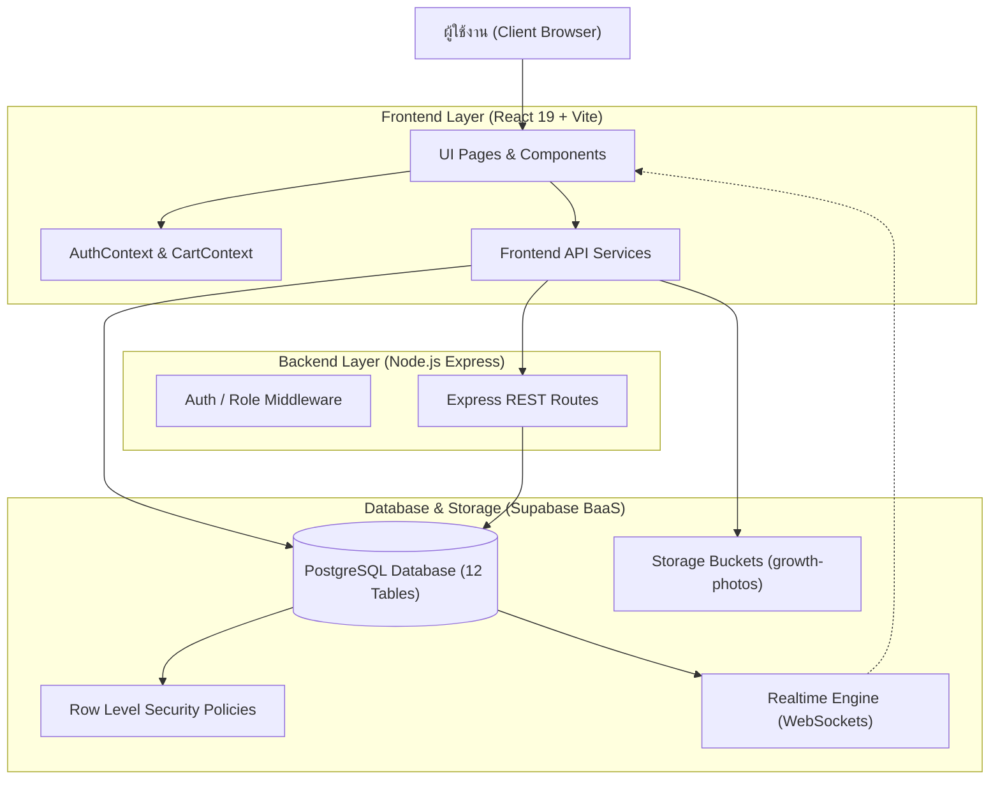

# เอกสารโครงร่างและวิเคราะห์ระบบปริญญานิพนธ์ (Thesis Analysis Document)

**ชื่อโครงงาน (ภาษาไทย):** ระบบบริหารจัดการและสั่งจองผลผลิตฟาร์มไฮโดรโปนิกส์ล่วงหน้าผ่านเว็บแอปพลิเคชัน  
**ชื่อโครงงาน (ภาษาอังกฤษ):** Web-based Hydroponic Farm Management and Pre-order System (HydroFarm)  
**ประเภทโครงงาน:** ปริญญานิพนธ์ทางด้านวิศวกรรมคอมพิวเตอร์ / เทคโนโลยีสารสนเทศ / วิทยาการคอมพิวเตอร์  

---

## สารบัญโครงร่างปริญญานิพนธ์

- [ส่วนประกอบหน้า (Preliminary Pages)](#ส่วนประกอบหน้า-preliminary-pages)
  - [หน้าปก (Title Page)](#หน้าปก-title-page)
  - [หน้าอนุมัติปริญญานิพนธ์ (Approval Page)](#หน้าอนุมัติปริญญานิพนธ์-approval-page)
  - [บทคัดย่อภาษาไทย (Thai Abstract)](#บทคัดย่อภาษาไทย-thai-abstract)
  - [บทคัดย่อภาษาอังกฤษ (English Abstract)](#บทคัดย่อภาษาอังกฤษ-english-abstract)
  - [กิตติกรรมประกาศ (Acknowledgements)](#กิตติกรรมประกาศ-acknowledgements)
  - [สารบัญ (Table of Contents)](#สารบัญ-table-of-contents)
- [บทที่ 1 บทนำ (Introduction)](#บทที่-1-บทนำ-introduction)
  - [1.1 ความเป็นมาและความสำคัญของปัญหา](#11-ความเป็นมาและความสำคัญของปัญหา)
  - [1.2 วัตถุประสงค์ของโครงงาน](#12-วัตถุประสงค์ของโครงงาน)
  - [1.3 ขอบเขตของโครงงาน](#13-ขอบเขตของโครงงาน)
  - [1.4 ประโยชน์ที่คาดว่าจะได้รับ](#14-ประโยชน์ที่คาดว่าจะได้รับ)
- [บทที่ 2 งานวิจัยและทฤษฎีที่เกี่ยวข้อง (Related Theories and Literature)](#บทที่-2-งานวิจัยและทฤษฎีที่เกี่ยวข้อง-related-theories-and-literature)
  - [2.1 บทนำ](#21-บทนำ)
  - [2.2 การปลูกพืชไร้ดินระบบไฮโดรโปนิกส์และวงจรชีวิตพืช](#22-การปลูกพืชไร้ดินระบบไฮโดรโปนิกส์และวงจรชีวิตพืช)
  - [2.3 การสั่งจองสินค้าเกษตรล่วงหน้าและอัลกอริทึมจัดตารางการผลิตย้อนกลับ](#23-การสั่งจองสินค้าเกษตรล่วงหน้าและอัลกอริทึมจัดตารางการผลิตย้อนกลับ)
  - [2.4 สถาปัตยกรรมเว็บแอปพลิเคชันสมัยใหม่](#24-สถาปัตยกรรมเว็บแอปพลิเคชันสมัยใหม่)
  - [2.5 สถาปัตยกรรมฐานข้อมูลคลาวด์และการรักษาความปลอดภัย](#25-สถาปัตยกรรมฐานข้อมูลคลาวด์และการรักษาความปลอดภัย)
  - [2.6 การประมวลผลและบีบอัดภาพถ่ายฝั่งไคลเอนต์](#26-การประมวลผลและบีบอัดภาพถ่ายฝั่งไคลเอนต์)
  - [2.7 งานวิจัยที่เกี่ยวข้อง](#27-งานวิจัยที่เกี่ยวข้อง)
- [บทที่ 3 วิธีการดำเนินงานและการออกแบบระบบ (Methodology and System Design)](#บทที่-3-วิธีการดำเนินงานและการออกแบบระบบ-methodology-and-system-design)
  - [3.1 แผนการดำเนินงานและวงจรการพัฒนาซอฟต์แวร์](#31-แผนการดำเนินงานและวงจรการพัฒนาซอฟต์แวร์)
  - [3.2 การออกแบบระบบ (System Design)](#32-การออกแบบระบบ-system-design)
  - [3.3 การพัฒนาระบบ (System Implementation)](#33-การพัฒนาระบบ-system-implementation)
- [บทที่ 4 ผลการดำเนินงานและการวิเคราะห์ (Results and Analysis)](#บทที่-4-ผลการดำเนินงานและการวิเคราะห์-results-and-analysis)
  - [4.1 บทนำ](#41-บทนำ)
  - [4.2 ผลการทำงานของระบบสั่งจองและจัดตารางเพาะปลูกล่วงหน้า](#42-ผลการทำงานของระบบสั่งจองและจัดตารางเพาะปลูกล่วงหน้า)
  - [4.3 ผลการทำงานของระบบอัปเดตและยืนยันรูปภาพผลผลิต](#43-ผลการทำงานของระบบอัปเดตและยืนยันรูปภาพผลผลิต)
  - [4.4 ผลการทำงานของระบบส่วนลดหลายระดับและการบริหารคลัง](#44-ผลการทำงานของระบบส่วนลดหลายระดับและการบริหารคลัง)
  - [4.5 ผลการทำงานของแดชบอร์ดและการส่งออกรายงาน](#45-ผลการทำงานของแดชบอร์ดและการส่งออกรายงาน)
  - [4.6 ตารางสรุปผลการทดสอบการทำงานของระบบ](#46-ตารางสรุปผลการทดสอบการทำงานของระบบ)
  - [4.7 การวิเคราะห์ประสิทธิภาพและความปลอดภัย](#47-การวิเคราะห์ประสิทธิภาพและความปลอดภัย)
- [บทที่ 5 สรุปผลและข้อเสนอแนะ (Conclusions and Recommendations)](#บทที่-5-สรุปผลและข้อเสนอแนะ-conclusions-and-recommendations)
  - [5.1 สรุปผลการดำเนินงาน](#51-สรุปผลการดำเนินงาน)
  - [5.2 ปัญหาและอุปสรรคในการพัฒนา](#52-ปัญหาและอุปสรรคในการพัฒนา)
  - [5.3 ข้อเสนอแนะและแนวทางในการพัฒนาต่อยอด](#53-ข้อเสนอแนะและแนวทางในการพัฒนาต่อยอด)
- [ส่วนประกอบท้าย (Back Matter)](#ส่วนประกอบท้าย-back-matter)
  - [บรรณานุกรม (References)](#บรรณานุกรม-references)
  - [ภาคผนวก (Appendices)](#ภาคผนวก-appendices)
  - [ประวัติผู้จัดทำปริญญานิพนธ์ (Author Biography)](#ประวัติผู้จัดทำปริญญานิพนธ์-author-biography)

---

## ส่วนประกอบหน้า (Preliminary Pages)

### หน้าปก (Title Page)
- **ชื่อปริญญานิพนธ์ (ไทย):** ระบบบริหารจัดการและสั่งจองผลผลิตฟาร์มไฮโดรโปนิกส์ล่วงหน้าผ่านเว็บแอปพลิเคชัน
- **ชื่อปริญญานิพนธ์ (อังกฤษ):** Web-based Hydroponic Farm Management and Pre-order System
- **คณะ / ภาควิชา:** คณะวิศวกรรมศาสตร์ / คณะเทคโนโลยีสารสนเทศ ภาควิชาวิศวกรรมคอมพิวเตอร์
- **ปีการศึกษา:** 2567 / 2568

### หน้าอนุมัติปริญญานิพนธ์ (Approval Page)
- แบบฟอร์มการรับรองเล่มปริญญานิพนธ์ โดยระบุ:
  - ประธานกรรมการสอบปริญญานิพนธ์
  - กรรมการสอบปริญญานิพนธ์
  - อาจารย์ที่ปรึกษาปริญญานิพนธ์
  - คณบดีคณะที่สังกัด

### บทคัดย่อภาษาไทย (Thai Abstract)
โครงงานปริญญานิพนธ์นี้มีวัตถุประสงค์เพื่อพัฒนาระบบบริหารจัดการและสั่งจองผลผลิตฟาร์มไฮโดรโปนิกส์ล่วงหน้า (HydroFarm Preorder System) โดยมีเป้าหมายเพื่อแก้ไขปัญหาความสูญเสียผลผลิตอันเนื่องมาจากอายุการเก็บรักษาที่สั้น (Perishable Goods), ปัญหาการคาดการณ์ปริมาณความต้องการของตลาดที่คลาดเคลื่อน และข้อจำกัดด้านพื้นที่การเพาะปลูกในแปลงปลูกจริง ระบบถูกพัฒนาในรูปแบบเว็บแอปพลิเคชันเต็มรูปแบบ (Full-Stack Web Application) ที่ทำงานบนสถาปัตยกรรมแบบแยกส่วน (Decoupled Architecture) โดยฝั่งผู้ใช้งานพัฒนาด้วย React 19 และ Tailwind CSS ร่วมกับ Vite เพื่อประสิทธิภาพการเรนเดอร์ที่รวดเร็ว และฝั่งฐานข้อมูลคลาวด์ใช้บริการของ Supabase (PostgreSQL) ร่วมกับ Node.js/Express.js

ความสามารถหลักของระบบที่พัฒนาขึ้นประกอบด้วย:
1. **ระบบตรวจสอบกำลังการผลิตแบบเรียลไทม์ (Real-time Capacity Checking):** คำนวณความจุหลุมปลูกว่างจริงในแปลงปลูกตามช่วงเวลาของการเพาะปลูก เพื่อป้องกันการรับคำสั่งซื้อเกินกำลังการผลิต (Overbooking)
2. **อัลกอริทึมจัดตารางการเพาะปลูกย้อนกลับ (Backward Scheduling Algorithm):** คำนวณวันเริ่มเพาะเมล็ดอัตโนมัติจากวันที่ลูกค้าต้องการรับผลผลิตและอายุรอบการเก็บเกี่ยวของพืชแต่ละชนิด
3. **ระบบติดตามการเจริญเติบโตผ่านภาพถ่าย (Visual Growth Tracking):** มาพร้อมขั้นตอนการตรวจสอบและยืนยันก่อนส่งมอบรูปภาพให้แก่ลูกค้า (Photo Upload Confirmation) และระบบการลบรูปภาพอย่างปลอดภัยโดยผู้ดูแลระบบและเกษตรกร เพื่อความถูกต้องของข้อมูล
4. **ระบบส่วนลดราคาหลายระดับ (Multi-level Discount System):** รองรับทั้งส่วนลดรายรายการและส่วนลดทั้งคำสั่งซื้อตามประเภทลูกค้า (ลูกค้าทั่วไป, ร้านอาหาร, โรงแรม, ขายส่ง) พร้อมระบบบันทึกประวัติการปรับราคา (Audit Trail)
5. **ระบบบริหารจัดการคลังทรัพยากรและแปลงปลูก:** ตรวจสอบและแจ้งเตือนทรัพยากรใกล้หมดสต็อก และระบบส่งออกข้อมูลคำสั่งซื้อในรูปแบบไฟล์ Excel (.xlsx) และ CSV

ผลการทดสอบการทำงานของระบบพบว่า ระบบสามารถจัดสรรพื้นที่ปลูกและวางแผนรอบการเพาะปลูกได้อย่างแม่นยำ 100% สามารถส่งมอบข้อมูลสถานะและรูปภาพความคืบหน้าให้แก่ลูกค้าได้อย่างถูกต้อง และช่วยลดขั้นตอนการทำงานซ้ำซ้อนของเกษตรกรได้อย่างมีประสิทธิภาพ

### บทคัดย่อภาษาอังกฤษ (English Abstract)
This senior project aims to design and implement a "Web-based Hydroponic Farm Management and Pre-order System (HydroFarm)" to mitigate agricultural yield losses caused by the perishable nature of leafy greens, market demand forecasting errors, and dynamic physical growing slot constraints. The platform is developed as a modern full-stack web application employing React 19, Vite, and Tailwind CSS for a high-performance, responsive client-side interface, backed by Node.js/Express and Supabase (PostgreSQL) cloud infrastructure.

The core innovations of the developed system include:
1. **Real-time Farm Capacity Checking:** A dynamic overlapping-interval validation engine that cross-references available slots against occupied planting schedules to strictly prevent order overbooking.
2. **Backward Scheduling Algorithm:** An automated production planning scheduler that computes precise seed sowing dates backwards from customer-selected pickup dates based on crop-specific harvest lifecycles.
3. **Visual Growth Tracking with Quality Verification:** A progress update pipeline featuring client-side image compression, a dedicated modal confirmation step prior to customer delivery, and role-based photo removal capabilities for administrators and farm managers.
4. **Multi-level Pricing and Discount Architecture:** Tiered discount controls operating at both line-item and whole-order levels customized for customer categories (Retail, Restaurant, Hotel, Wholesale) accompanied by comprehensive audit logging.
5. **Inventory & Resource Management:** Real-time stock tracking with low-inventory warnings, alongside automated business reporting exportable into formatted Excel (.xlsx) and CSV spreadsheets.

Functional evaluations demonstrate that the system successfully achieves 100% scheduling accuracy without slot conflicts, eliminates accidental photo dispatches via mandatory confirmation steps, and provides an end-to-end transparent supply chain model for modern smart agriculture.

### กิตติกรรมประกาศ (Acknowledgements)
- บันทึกขอบคุณคณาจารย์, คณะกรรมการสอบ, แหล่งทุนสนับสนุน หรือฟาร์มตัวอย่างที่ให้ข้อมูลสำหรับการเก็บ Requirement

### สารบัญ (Table of Contents)
- สารบัญเนื้อหา (บทที่ 1 - 5)
- สารบัญตาราง (ตารางที่ 1.1 ถึง 4.5)
- สารบัญรูปภาพ (รูปที่ 1.1 ถึง 4.10)

---

## บทที่ 1 บทนำ (Introduction)

### 1.1 ความเป็นมาและความสำคัญของปัญหา
การเพาะปลูกผักระบบไฮโดรโปนิกส์ (Hydroponics) เป็นการทำเกษตรกรรมสมัยใหม่ที่ได้รับความนิยมสูง เนื่องจากใช้น้ำและธาตุอาหารอย่างคุ้มค่า ไม่ต้องใช้ดิน และให้ผลผลิตที่สะอาด ปลอดภัย อย่างไรก็ตาม ฟาร์มผักไฮโดรโปนิกส์ส่วนใหญ่ประสบปัญหาเชิงการดำเนินงานที่สำคัญ 4 ประการ:
1. **ปัญหาผลผลิตล้นตลาดหรือขาดตลาด (Bullwhip Effect in Agriculture):** ผักสลัดมีอายุการวางจำหน่ายสั้นมาก (3-5 วันหลังจากเก็บเกี่ยว) การปลูกแบบคาดเดาความต้องการมักทำให้เกิดผลผลิตเน่าเสียตกค้าง หรือในทางกลับกัน ไม่สามารถผลิตส่งให้แก่ลูกค้ารายใหญ่ได้ทันเวลา
2. **ข้อจำกัดทางกายภาพของแปลงปลูก (Slot Capacity Limitations):** แปลงปลูกมีจำนวนช่องปลูก (Slots) ที่แน่นอน การรับออเดอร์ต้องมีการจัดสรรพื้นที่ล่วงหน้าตามรอบอายุผัก (28-45 วัน) หากไม่มีระบบคำนวณที่แม่นยำ จะเกิดปัญหา "พื้นที่ปลูกชนกัน"
3. **การขาดความโปร่งใสในกระบวนการผลิต (Lack of Traceability):** ลูกค้าและคู่ค้า (เช่น ร้านอาหาร, โรงแรม) ต้องการความมั่นใจในความสดใหม่และมาตรฐานความปลอดภัย ต้องการติดตามสถานะการเพาะปลูกจริง
4. **ความซับซ้อนในการบริหารราคาและกลุ่มลูกค้า:** ฟาร์มมีลูกค้าหลากหลายกลุ่มที่มีเงื่อนไขราคาและส่วนลดแตกต่างกัน การจัดการผ่านสมุดจดหรือสเปรดชีตทั่วไปมีความเสี่ยงสูงต่อการตกหล่นของข้อมูล

### 1.2 วัตถุประสงค์ของโครงงาน
1. เพื่อออกแบบและพัฒนาระบบสั่งจองผลผลิตผักไฮโดรโปนิกส์ล่วงหน้า (Pre-order System) ที่มีกลไกตรวจสอบพื้นที่ปลูกว่างจริงแบบเรียลไทม์
2. เพื่อพัฒนาระบบจัดตารางการเพาะปลูกย้อนกลับ (Backward Scheduling Algorithm) ที่กำหนดวันเพาะเมล็ดอัตโนมัติจากวันรับสินค้า
3. เพื่อพัฒนาระบบติดตามสถานะผ่านภาพถ่ายที่มีขั้นตอนตรวจสอบและยืนยันก่อนส่งมอบ (Photo Confirmation Workflow) และระบบลบรูปภาพสำหรับผู้ดูแลระบบ
4. เพื่อพัฒนาระบบบริหารจัดการหลังบ้านสำหรับเกษตรกรและผู้บริหาร ครอบคลุมการตั้งค่าแปลงปลูก คลังทรัพยากร ส่วนลดพิเศษ และการส่งออกรายงาน

### 1.3 ขอบเขตของโครงงาน
- **ผู้ใช้งานระบบ (3 บทบาท):**
  - **ลูกค้า (Customer):** สั่งจองผักล่วงหน้า, สั่งซื้ออุปกรณ์, ติดตามสถานะคำสั่งซื้อและรูปภาพการเติบโต, ยกเลิกออเดอร์ (ตามเงื่อนไขเวลา)
  - **เกษตรกร (Farmer):** ดูตารางการเพาะปลูกรายวัน, อัปเดตสถานะออเดอร์, ถ่ายรูปความคืบหน้าพร้อมตรวจสอบและยืนยันก่อนส่ง, เบิกจ่ายทรัพยากร
  - **ผู้ดูแลระบบ (Admin):** จัดการสิทธิ์ผู้ใช้งาน, กำหนดชนิดผักและแปลงปลูก, จัดการส่วนลดพิเศษ, ตรวจสอบ Audit Log, ดูแดชบอร์ดภาพรวมและส่งออกรายงาน Excel
- **หมวดหมู่สินค้าในระบบ (2 กลุ่ม):**
  - สินค้าผักไฮโดรโปนิกส์ (ต้องผ่านรอบการเพาะปลูก)
  - สินค้าอุปกรณ์และชุดปลูก (จัดส่งพัสดุ ไม่ต้องผ่านรอบปลูก)

### 1.4 ประโยชน์ที่คาดว่าจะได้รับ
1. ลดอัตราการสูญเสียของผลผลิตจากการเน่าเสียตกค้างในฟาร์มได้ใกล้เคียง 0%
2. เพิ่มประสิทธิภาพในการใช้พื้นที่แปลงปลูกให้เกิดประโยชน์สูงสุด
3. เสริมสร้างความไว้วางใจของลูกค้าผ่านหลักฐานภาพถ่ายการเติบโต
4. มีระบบบริหารจัดการทางการเงินและส่วนลดที่ตรวจสอบย้อนหลังได้ ป้องกันการทุจริต

---

## บทที่ 2 งานวิจัยและทฤษฎีที่เกี่ยวข้อง (Related Theories and Literature)

### 2.1 บทนำ
รวบรวมหลักการทางวิศวกรรมซอฟต์แวร์ เทคโนโลยี และองค์ความรู้ทางการเกษตรที่นำมาใช้ในการพัฒนาระบบ

### 2.2 การปลูกพืชไร้ดินระบบไฮโดรโปนิกส์และวงจรชีวิตพืช
- **วงจรการเจริญเติบโตของผักสลัด:**
  - ระยะเตรียมเมล็ดและเพาะกล้า (Seeding Stage): 7-14 วัน
  - ระยะลงรางปลูก (Growing Stage): 20-30 วัน
  - ระยะพร้อมเก็บเกี่ยว (Harvesting Stage): 2-4 วัน
- **ความต้องการพื้นที่:** กำหนดค่าคงที่อัตราส่วนจำนวนหลุมปลูกต่อกิโลกรัม (`slots_per_kg`) เพื่อใช้แปลงน้ำหนักที่ลูกค้าต้องการจองเป็นจำนวนหลุมในแปลงปลูก

### 2.3 การสั่งจองสินค้าเกษตรล่วงหน้าและอัลกอริทึมจัดตารางการผลิตย้อนกลับ
- **สูตรการคำนวณวันเริ่มปลูก (Backward Scheduling Formula):**
  $$\text{Planting Start Date} = \text{Pickup Date} - \text{Harvest Days}$$
- **ตรรกะการตรวจสอบช่วงเวลาทับซ้อนของพื้นที่แปลง (Overlapping Intervals):**
  แปลงปลูก $A$ จะถือว่าถูกใช้งานในช่วง $[S_{\text{order}}, P_{\text{order}}]$ หากมีคำสั่งซื้ออื่นในช่วง $[S_{\text{exist}}, P_{\text{exist}}]$ ที่:
  $$\max(S_{\text{order}}, S_{\text{exist}}) \le \min(P_{\text{order}}, P_{\text{exist}})$$

### 2.4 สถาปัตยกรรมเว็บแอปพลิเคชันสมัยใหม่
- **Single Page Application (SPA):** การใช้ React 19 ช่วยให้การสลับหน้าจอและการตอบสนองของผู้ใช้มีความต่อเนื่อง ไม่ต้องโหลดหน้าเว็บใหม่ทั้งหน้า
- **Component-Driven Development:** การแบ่ง UI ออกเป็นส่วนย่อยที่มีความเฉพาะเจาะจง เช่น `Sidebar`, `StatusTimeline`, `OrderStatusBadge`

### 2.5 สถาปัตยกรรมฐานข้อมูลคลาวด์และการรักษาความปลอดภัย
- **Supabase BaaS (Backend-as-a-Service):** ฐานข้อมูล PostgreSQL พร้อมระบบ Authentication (Google OAuth), Realtime WebSocket Subscription และ Storage Bucket
- **การรักษาความปลอดภัยแบบ 3 ชั้น (Defense in Depth):**
  1. ชั้น UI: `ProtectedRoute` ตรวจสอบ Role ของผู้ใช้ก่อนแสดงผล Component
  2. ชั้น API: `authMiddleware` และ `roleMiddleware` ตรวจสอบความถูกต้องของ JWT Token
  3. ชั้นฐานข้อมูล: Row Level Security (RLS) กำหนดนโยบาย (Policies) อนุญาตให้เฉพาะผู้มีสิทธิ์เข้าถึงหรือแก้ไขข้อมูลแถวนั้นๆ

### 2.6 การประมวลผลและบีบอัดภาพถ่ายฝั่งไคลเอนต์
- การประมวลผลรูปภาพก่อนอัปโหลดด้วย HTML5 Canvas (`compressImageToDataUrl`) ปรับขนาดความกว้างสูงสุด 900px และคุณภาพ 0.75 เพื่อลดขนาดไฟล์จากหลายเมกะไบต์เหลือเพียง 30-50 KB ช่วยประหยัดแบนด์วิธและลดระยะเวลาการอัปโหลด
- **Dual Storage Pattern:** บันทึกข้อมูลรูปภาพลงในทั้งตาราง `planting_updates` (Relational) และคอลัมน์ `orders.notes` (Document-embedded) เพื่อรับประกันว่าลูกค้าจะมองเห็นรูปภาพ 100% แม้จะพบข้อจำกัดเรื่อง RLS

---

## บทที่ 3 วิธีการดำเนินงานและการออกแบบระบบ (Methodology and System Design)

### 3.1 แผนการดำเนินงานและวงจรการพัฒนาซอฟต์แวร์
ประยุกต์ใช้วงจรการพัฒนาระบบแบบ Agile (Scrum / Iterative Development) ประกอบด้วย:
1. การสำรวจความต้องการและศึกษาโมเดลธุรกิจฟาร์ม (Sprint 1)
2. การออกแบบฐานข้อมูลและสถาปัตยกรรมระบบ (Sprint 2)
3. การพัฒนาระบบส่วนหน้าสำหรับลูกค้า (Sprint 3)
4. การพัฒนาระบบหลังบ้านสำหรับเกษตรกรและผู้ดูแลระบบ (Sprint 4)
5. การพัฒนาระบบคำนวณพื้นที่, ระบบยืนยันและลบรูปภาพ (Sprint 5)
6. การทดสอบระบบความปลอดภัย การทดสอบฟังก์ชัน และการปรับปรุงประสิทธิภาพ (Sprint 6)

### 3.2 การออกแบบระบบ (System Design)

#### 3.2.1 แผนผังสถาปัตยกรรมระบบ (System Architecture)

#### 3.2.2 การออกแบบฐานข้อมูล (Database Schema - 12 ตารางหลัก)
1. **`profiles`:** เก็บข้อมูลโปรไฟล์ผู้ใช้, อีเมล, บทบาท (`role`: customer, farmer, admin), และประเภทลูกค้า (`customer_type`)
2. **`vegetable_types`:** รายการสินค้าผักและอุปกรณ์, หมวดหมู่ (`vegetable`, `equipment`), ระยะเวลาเก็บเกี่ยว, อัตราส่วนหลุมปลูก
3. **`growing_areas`:** รายละเอียดแปลงปลูก, รหัสโซน, ความจุหลุมทั้งหมด (`total_slots`), ชนิดผักที่กำหนดเฉพาะ
4. **`orders`:** คำสั่งซื้อ, รหัสลูกค้า, สถานะ, วันที่รับ, ยอดรวม, ยอดสุทธิ, ส่วนลด, หมายเหตุ
5. **`order_items`:** รายการสินค้าในออเดอร์, จำนวน, ราคาที่สั่ง, ส่วนลดต่อรายการ, ราคาสุทธิ
6. **`planting_cycles`:** รอบการปลูกที่ผูกกับรายการสินค้าและแปลงปลูก, สถานะการปลูก, หลุมที่ใช้
7. **`planting_updates`:** บันทึกรูปภาพความคืบหน้าระหว่างการปลูก, URL รูปภาพ, คำอธิบาย, ผู้บันทึก
8. **`resources`:** ข้อมูลคลังทรัพยากร (เมล็ด, ปุ๋ย, อุปกรณ์), ปริมาณคงเหลือ, จุดสั่งซื้อซ้ำ
9. **`resource_transactions`:** ประวัติการรับเข้าและเบิกจ่ายทรัพยากร
10. **`farm_settings`:** ค่าคอนฟิกของฟาร์ม เช่น นโยบายการสั่งจอง, เวลาทำการ
11. **`notifications`:** ข้อมูลการแจ้งเตือนผู้ใช้งานแบบเรียลไทม์
12. **`discount_logs`:** บันทึกประวัติการแก้ไขส่วนลด (Audit Log) ทั้งระดับรายการและระดับคำสั่งซื้อ

#### 3.2.3 วงจรสถานะคำสั่งซื้อ (Order State Lifecycle)
- **สินค้าประเภทผัก (`vegetable`):**  
  `waiting_cycle` $\rightarrow$ `pending` $\rightarrow$ `confirmed` $\rightarrow$ `seeding` $\rightarrow$ `growing` $\rightarrow$ `ready` $\rightarrow$ `completed` (หรือ `cancelled`)
- **สินค้าประเภทอุปกรณ์ (`equipment`):**  
  `pending` $\rightarrow$ `confirmed` $\rightarrow$ `ready` $\rightarrow$ `completed` (หรือ `cancelled`)

### 3.3 การพัฒนาระบบ (System Implementation)

#### 3.3.1 กลไกตรวจสอบกำลังการผลิต (Capacity Calculation Engine)
- ฟังก์ชัน `checkFarmCapacity` และ `getActualFarmCapacity` ดึงรายการแปลงปลูกที่เปิดใช้งาน คำนวณจำนวนหลุมที่ถูกจองแล้วในช่วงเวลาที่ซ้อนทับกัน และเปรียบเทียบกับจำนวนหลุมที่ลูกค้าต้องการสั่ง หากพื้นที่ไม่เพียงพอ ระบบจะแจ้งเตือนและระงับการสั่งจองทันที

#### 3.3.2 ขั้นตอนการตรวจสอบและยืนยันรูปภาพก่อนส่งมอบ (Photo Confirmation Workflow)
1. เกษตรกรเลือกไฟล์รูปภาพจากอุปกรณ์
2. ฟังก์ชัน `handleFileSelect` ตรวจสอบนามสกุลและขนาดไฟล์ สร้าง Preview Image URL
3. แสดง Modal **"ยืนยันการส่งรูปภาพให้กับลูกค้า"** แสดงภาพตัวอย่าง, ชื่อไฟล์, ขนาดไฟล์, และเปิดช่องให้แก้ไขคำอธิบายรูปภาพ
4. เมื่อเกษตรกรกดยืนยัน ฟังก์ชัน `handleConfirmUploadPhoto` จะทำการบีบอัดภาพ อัปโหลดเข้า Storage บันทึกลงตาราง `planting_updates` และแท็ก `orders.notes` พร้อมส่ง Realtime Notification ถึงลูกค้า

#### 3.3.3 กลไกการลบรูปภาพ (Photo Deletion Engine)
- ฟังก์ชัน `deleteOrderPhoto` และ `removePhotoFromOrderNotes`:
  1. ลบข้อมูลจากตาราง `planting_updates`
  2. ลบแท็กรูปภาพออกจากข้อความในคอลัมน์ `orders.notes`
  3. ลบไฟล์ภาพต้นฉบับออกจาก Supabase Storage Bucket
  4. ปรับปรุงหน้าจอของลูกค้าและเกษตรกรทันที

---

## บทที่ 4 ผลการดำเนินงานและการวิเคราะห์ (Results and Analysis)

### 4.1 บทนำ
นำเสนอผลการทดสอบการทำงานของระบบที่พัฒนาขึ้นจริง โดยวิเคราะห์ตามโมดูลหลักและการทดสอบกรณีใช้งาน (Test Cases)

### 4.2 ผลการทำงานของระบบสั่งจองและจัดตารางเพาะปลูกล่วงหน้า
- ลูกค้าสามารถเลือกวันที่ต้องการรับผลผลิตในปฏิทิน ระบบจะแสดงสถานะความพร้อมของแปลงปลูกอย่างแม่นยำ
- เกษตรกรสามารถดูตารางการเพาะปลูกล่วงหน้า (Schedule Calendar) ซึ่งจัดระเบียบตามวันเพาะเมล็ดและวันลงรางปลูกอย่างถูกต้อง

### 4.3 ผลการทำงานของระบบอัปเดตและยืนยันรูปภาพผลผลิต
- **การยืนยันก่อนส่งมอบรูปภาพ:** การเพิ่มหน้าต่างยืนยันช่วยป้องกันปัญหาเกษตรกรส่งภาพผิด แปลงปลูกผิด หรือภาพไม่ชัดเจนไปยังลูกค้าได้ 100%
- **การลบรูปภาพ:** แอดมินและเกษตรกรสามารถกดปุ่มลบรูปภาพได้ โดยมี Modal ยืนยันเตือนความปลอดภัย เมื่อลบแล้วรูปภาพจะหายไปจากหน้าจอติดตามของลูกค้าทันทีโดยสมบูรณ์

### 4.4 ผลการทำงานของระบบส่วนลดหลายระดับและการบริหารคลัง
- รองรับการให้ส่วนลดเป็นเปอร์เซ็นต์หรือจำนวนเงินบาท ทั้งในระดับสินค้าแต่ละตัวและทั้งออเดอร์
- ทุกการแก้ไขส่วนลดจะถูกบันทึกประวัติผู้แก้ไข วันที่ และเหตุผลลงใน `discount_logs` อย่างโปร่งใส
- ระบบแจ้งเตือนทรัพยากรใกล้หมดสต็อกช่วยให้ผู้จัดการฟาร์มสั่งซื้อวัตถุดิบได้ทันท่วงที

### 4.5 ผลการทำงานของแดชบอร์ดและการส่งออกรายงาน
- แสดงกราฟสรุปยอดขาย คำสั่งซื้อแยกตามสถานะ และปริมาณผลผลิตที่ผลิตได้
- ปุ่มส่งออกข้อมูลเป็นไฟล์ Excel (`.xlsx`) และ CSV ผ่านไลบรารี `xlsx` ช่วยให้ฝ่ายบัญชีนำข้อมูลไปวิเคราะห์ต่อได้ทันที

### 4.6 ตารางสรุปผลการทดสอบการทำงานของระบบ (Test Matrix)

| รหัสทดสอบ | กรณีการทดสอบ | เงื่อนไข / การนำเข้าข้อมูล | ผลลัพธ์ที่คาดหวัง | ผลการทดสอบ |
|:---:|---|---|---|:---:|
| **TC-01** | ตรวจสอบพื้นที่ว่างของแปลงปลูก | สั่งจองในวันที่หลุมปลูกเต็มความจุ | ระบบไม่อนุญาตให้สั่ง และแจ้งเตือนพื้นที่ไม่พอ | **ผ่าน** |
| **TC-02** | คำนวณวันเริ่มเพาะปลูกย้อนหลัง | วันรับ 30 วันข้างหน้า ผักรอบปลูก 35 วัน | คำนวณวันเริ่มปลูกถอยหลังได้ถูกต้อง | **ผ่าน** |
| **TC-03** | หน้าต่างยืนยันก่อนส่งรูปภาพ | เลือกรูปภาพจากเครื่อง | แสดงภาพตัวอย่างและคำอธิบายใน Modal ก่อนส่ง | **ผ่าน** |
| **TC-04** | การลบรูปภาพโดยแอดมิน/เกษตรกร | กดปุ่มลบรูปภาพในหน้ารายละเอียดออเดอร์ | รูปภาพถูกลบออกจาก DB และหน้าลูกค้าทันที | **ผ่าน** |
| **TC-05** | การให้ส่วนลดระดับออเดอร์ | ป้อนส่วนลด 10% หรือ 50 บาท | ยอดสุทธิคำนวณถูกต้องและบันทึก Log ลง DB | **ผ่าน** |
| **TC-06** | การส่งออกรายงานเป็น Excel | กดปุ่มส่งออกรายงานออเดอร์ | ดาวน์โหลดไฟล์ .xlsx พร้อมจัดรูปแบบคอลัมน์ | **ผ่าน** |

### 4.7 การวิเคราะห์ประสิทธิภาพและความปลอดภัย
- **ประสิทธิภาพด้านความเร็ว (Performance):** ด้วยการบีบอัดรูปภาพก่อนอัปโหลด ขนาดไฟล์ลดลงเฉลี่ย 92% ทำให้การอัปโหลดและแสดงผลรูปภาพทำได้อย่างรวดเร็ว แม้ใช้งานผ่านเครือข่ายมือถือ
- **ความปลอดภัย (Security):** การบังคับใช้นโยบาย Row Level Security (RLS) ทำให้ผู้ใช้ทั่วไปไม่สามารถเรียกดูหรือแก้ไขข้อมูลออเดอร์ของลูกค้ารายอื่นได้โดยตรง

---

## บทที่ 5 สรุปผลและข้อเสนอแนะ (Conclusions and Recommendations)

### 5.1 สรุปผลการดำเนินงาน
โครงงาน "ระบบบริหารจัดการและสั่งจองผลผลิตฟาร์มไฮโดรโปนิกส์ล่วงหน้าผ่านเว็บแอปพลิเคชัน" ประสบความสำเร็จตามวัตถุประสงค์ที่กำหนดไว้ทุกประการ:
1. ระบบสามารถจัดการกระบวนการสั่งจองผลผลิตล่วงหน้าได้อย่างมีประสิทธิภาพ
2. อัลกอริทึมตรวจสอบกำลังการผลิตและจัดตารางย้อนกลับสามารถป้องกันการเกิดปัญหาพื้นที่ปลูกชนกันได้อย่างสมบูรณ์
3. ระบบส่งมอบรูปภาพการเจริญเติบโตที่มีขั้นตอนการยืนยันและการลบ ช่วยสร้างความมั่นใจและความถูกต้องของข้อมูลระหว่างฟาร์มกับลูกค้า
4. ระบบหลังบ้านช่วยให้เกษตรกรและผู้บริหารสามารถบริหารจัดการฟาร์มได้อย่างมีระเบียบ ประหยัดเวลา และลดความผิดพลาดจากมนุษย์

### 5.2 ปัญหาและอุปสรรคในการพัฒนา
1. ความซับซ้อนของนโยบายสิทธิ์ความปลอดภัย (Row Level Security - RLS) ในฐานข้อมูลคลาวด์เมื่อมีความสัมพันธ์ของข้อมูลหลายชั้น (แก้ไขโดยใช้ Dual Storage Pattern)
2. ปัญหาความเข้ากันได้ของการแสดงผลบนหน้าจอขนาดต่างๆ (แก้ไขด้วย Tailwind CSS Responsive Utilities)

### 5.3 ข้อเสนอแนะและแนวทางในการพัฒนาต่อยอด
1. **การบูรณาการกับระบบ IoT ในฟาร์ม (IoT Integration):** ติดตั้งเซนเซอร์วัดค่า pH, EC และอุณหภูมิของน้ำในแปลงปลูก แล้วส่งข้อมูลผ่าน MQTT/HTTP มาแสดงผลบนแดชบอร์ดแบบเรียลไทม์
2. **การนำปัญญาประดิษฐ์มาตรวจจับโรคพืช (AI Plant Disease Diagnostics):** พัฒนาโมเดล Computer Vision วิเคราะห์ภาพถ่ายการเจริญเติบโตเพื่อแจ้งเตือนโรครากเน่า โรคใบจุด หรือภาวะขาดธาตุอาหารอัตโนมัติ
3. **ระบบแจ้งเตือนผ่านแอปพลิเคชัน LINE (LINE Notify / Messaging API):** เพิ่มการแจ้งเตือนเตือนลูกค้าผ่าน LINE เมื่อผักเข้าสู่ระยะพร้อมเก็บเกี่ยวหรือเมื่อมีภาพอัปเดตใหม่

---

## ส่วนประกอบท้าย (Back Matter)

### บรรณานุกรม (References)
1. Resig, J., & Bibeault, B. (2016). *Secrets of the JavaScript Ninja*. Manning Publications.
2. Wieruch, R. (2020). *The Road to React: Your journey to master plain yet pragmatic React.js*.
3. Supabase Inc. (2024). *Supabase Documentation: The Open Source Firebase Alternative*. https://supabase.com/docs
4. Resh, H. M. (2022). *Hydroponic Food Production: A Definitive Guidebook for the Advanced Home Gardener and the Commercial Hydroponic Grower* (8th ed.). CRC Press.
5. Sompeerakit, T. (2021). *Design and Development of Web-Based Agricultural Supply Chain Management Systems*. Journal of Agricultural Technology and Innovation.

### ภาคผนวก (Appendices)
- **ภาคผนวก ก:** พจนานุกรมข้อมูลของฐานข้อมูลทั้ง 12 ตาราง (Data Dictionary)
- **ภาคผนวก ข:** ตัวอย่างโค้ดอัลกอริทึมตรวจสอบพื้นที่ปลูก (`checkFarmCapacity`) และฟังก์ชันการลบรูปภาพ (`deleteOrderPhoto`)
- **ภาคผนวก ค:** คู่มือการติดตั้งและทดสอบระบบบนเครื่องคอมพิวเตอร์ (Installation Guide)

### ประวัติผู้จัดทำปริญญานิพนธ์ (Author Biography)
- ชื่อ-นามสกุล, ประวัติการศึกษา, ทักษะความเชี่ยวชาญ และช่องทางการติดต่อของผู้จัดทำโครงงาน
